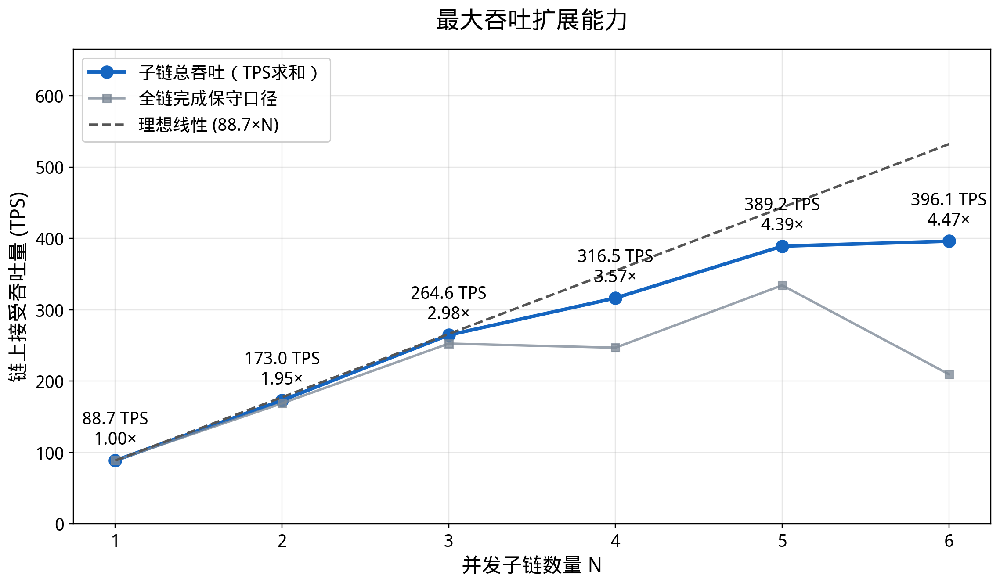

# 最大吞吐量容量实验

## 目的

该实验用于展示多子链架构在高压提交场景下的系统总吞吐扩展能力。不同于低频 workload 的主链负载实验，本实验直接把每条活跃子链压到 `MaxSubmissionsPerEpoch=10000`，用链上接受时间计算 TPS。

## 关键配置

- `MaxSubmissionsPerEpoch=10000`
- `CollectingSlotBlocks=600`
- `SyncingSlotBlocks=20`
- `submit_mode=pool`
- `workers=100`
- `parallel_per_worker=8`
- 每轮 N 执行前 reset 活跃子链数据库，保留 keystore。
- child2/child3/child5 在本轮容量实验中临时使用默认 `fishbone-node`，避免 1s/2s/10MB 异构配置干扰线性扩展判断。
- child3 的压测 RPC 入口使用 `ws://10.2.2.18:9947`。原入口 `ws://10.2.2.17:9947` 会因 f7 同时承载 child4/main/child3 而显著拖慢 child3。

## 数据口径

输出文件：

- `docs/figures/data/exp_capacity_summary.csv`
- `docs/figures/fig_capacity_scaling.png`
- `docs/figures/data/raw/capacity_10000_sameconfig_final/`
- `docs/figures/data/raw/capacity_10000_sameconfig_final_logs/`

CSV 中保留两个 TPS 口径：

- `sum_individual_chain_tps`：各子链链上接受 TPS 求和，用作系统总吞吐主口径。
- `aggregate_chain_accepted_tps`：`N * 10000 / 最慢链到达 10000 的时间`，用作全链完成保守口径。

## 最终结果

| N | 子链总吞吐 TPS | 对比 N=1 | 全链完成保守 TPS |
|---|---------------:|---------:|-----------------:|
| 1 | 88.69 | 1.00x | 88.69 |
| 2 | 172.96 | 1.95x | 168.85 |
| 3 | 264.58 | 2.98x | 252.62 |
| 4 | 316.46 | 3.57x | 246.87 |
| 5 | 389.18 | 4.39x | 334.32 |
| 6 | 396.12 | 4.47x | 209.62 |



## 结论

在 6 条子链并发时，系统总链上接受吞吐达到 `396.12 TPS`，约为单链基准的 `4.47x`。N=6 没有继续接近理想 6x，主要受 child5 和 child3 的单链吞吐拖尾影响；这属于子链局部瓶颈，不是主链吞吐被占满。

该图适合用于说明：新增子链可以显著提高系统总吞吐，高频 worker 提交留在子链处理；主链负载是否充裕应结合 `docs/linear-scaling-mainchain-load.md` 中的主链负载占比实验说明。

## 复现实验

```bash
RUN_ID=capacity_10000_sameconfig_child3f8_n4to6_$(date +%Y%m%d_%H%M%S) \
N_START=4 N_END=6 \
CHILD3_WS=ws://10.2.2.18:9947 \
DURATION=420 \
CAPACITY_MONITOR_TIMEOUT=900 \
WAIT_TIMEOUT=900 \
WAIT_MIN_REMAINING_BLOCKS=300 \
SETUP_MAX_WORKERS=300 \
WORKERS=100 \
PARALLEL_PER_WORKER=8 \
SUBMIT_MODE=pool \
./scripts/run_exp_capacity_reset_each_n.sh
```

N=1..3 可使用同一脚本默认入口运行；N=4..6 建议保持 child3=f8 入口。
