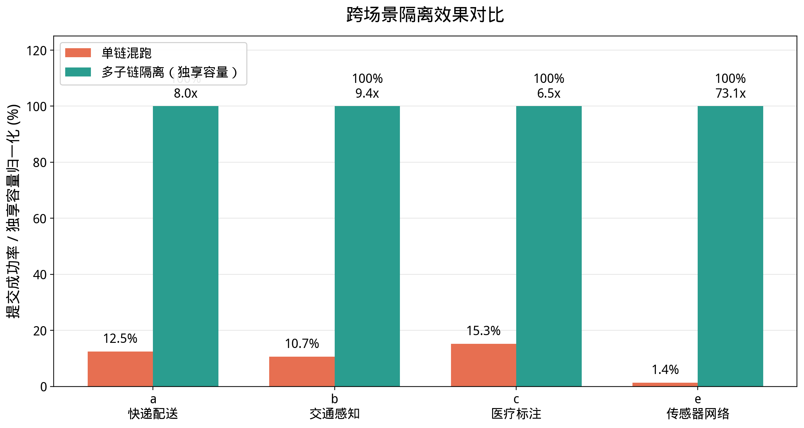

# 跨场景隔离实验记录

## 目的

该实验用于直接展示多子链隔离架构相对单链混跑的优势：当异构 workload 共享同一条子链时，高频任务会快速耗尽 `MaxSubmissionsPerEpoch`，低频或高价值任务被挤压；当每个场景运行在独立子链上时，容量上限变为各子链独立拥有，不再互相竞争。

## 数据文件

- `docs/experiments/figures/data/exp_isolation_summary.csv`
- `docs/experiments/figures/fig_isolation_comparison.png`

## 口径

单链混跑数据来自 Exp A worker 统计：

- 场景 a/b/c/e 同时提交到 child1。
- 统计每个场景的 `ok` 与 `reject`。
- 成功率为 `ok / (ok + reject)`。

多子链隔离列采用“独享 epoch 容量归一化”口径：

- 每个场景独占一条子链，不与其他场景竞争 `MaxSubmissionsPerEpoch`。
- 图中 100% 表示该场景不再被其他场景挤占共享容量，不等同于长期真实运行中没有任何链上约束拒绝。

## 结果

| 场景 | 单链混跑成功率 | 多子链隔离归一化 | 改善 |
|------|---------------:|-----------------:|-----:|
| a 快递配送 | 12.46% | 100% | 8.03x |
| b 交通感知 | 10.67% | 100% | 9.37x |
| c 医疗标注 | 15.26% | 100% | 6.55x |
| e 传感器网络 | 1.37% | 100% | 73.13x |

## 结论

跨场景隔离的核心收益不是让每条链无限吞吐，而是把“所有场景共享一个 epoch 上限”变为“每个场景独享自己的子链上限”。因此，低频/高价值任务不再被高频微任务挤出，系统整体行为更可预测。
