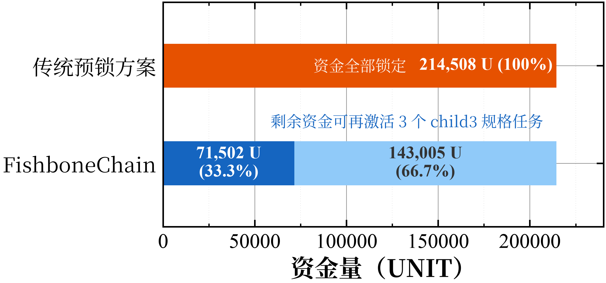

# 5. 性能评估

## 5.1 实验设置

为评估 FishboneChain 在异质众包业务中的性能表现，本文基于 Substrate 实现系统原型，并在 18 台虚拟机节点上进行实验。每台虚拟机配置 8 vCPU、16 GB 内存和约 97 GB 磁盘，节点间通过千兆内网互联，操作系统为 Ubuntu 22.04 LTS。系统采用 BABE 区块生产机制，主链和子链均以多验证节点方式部署。主链验证节点运行于全部 18 台机器上；子链压力测试中，每条子链使用 3 个验证节点，child1 至 child6 分别部署在 f1–f3、f4–f6、f7–f9、f10–f12、f13–f15 和 f16–f18 上。压力测试客户端运行于独立控制主机。为避免历史状态影响实验结果，每次吞吐量测试前均停止既有子链进程并清理对应链数据库，随后重新启动待测试子链并初始化任务状态。

实验选取四类具有代表性的异质众包任务：快递配送、交通感知、医疗标注和传感器网络。上述任务在提交频率、任务规模、奖励预算和数据体量上存在明显差异。例如，交通感知和传感器网络属于高频低价值任务，容易在短时间内产生大量提交；医疗标注属于低频高价值任务，单次预算较高但提交频率较低。该设置用于模拟真实平台中多类型业务共存时的资源竞争现象。

本文主要评估三个指标。第一，提交成功率，用于衡量异质任务在共享容量或独立容量下能否完成有效提交。第二，子链总吞吐量，用单位时间内所有活跃子链接受的业务提交数量表示。第三，主链容量占用率，用于衡量多子链桥接操作对主链造成的压力。需要说明的是，FishboneChain 中高频业务交易由子链处理，主链不直接承载每笔业务提交，而只在 epoch 级别接收子链摘要和结算相关交易。因此，主链容量占用率定义为理论桥接吞吐量与主链独立压测得到的最大吞吐量之比。实验中 epoch 长度为 120 秒，每条子链每个 epoch 固定产生 2 笔桥接 extrinsic，主链 18 节点 transfer 压测得到的最大吞吐量为 75.66 TPS。资金实验中，资金效率通过锁定资金比例和同等预算下可支持任务组数量进行衡量。

## 5.2 子链隔离与吞吐扩展

首先评估单链混跑场景下的资源竞争问题。我们将四类异质任务部署在同一条共享链上，并设置每个 epoch 的总提交容量上限为 1000 次。在该模式下，所有任务需要竞争同一链上容量。实验结果如图 1 所示，单链混跑时快递配送、交通感知、医疗标注和传感器网络的提交成功率分别为 12.46%、10.67%、15.26% 和 1.37%。可以看到，高频任务会在 epoch 开始后迅速消耗共享容量，导致低频高价值任务无法获得稳定的提交机会。该结果说明，在异质任务并发运行时，单链或单子链混跑模式难以同时保证不同业务的服务质量。

图 1 跨场景隔离效果对比

随后将四类任务分别部署到独立子链中，使每类任务拥有独立的链上容量。隔离后，各场景提交成功率均恢复至 100%。相较于单链混跑，快递配送、交通感知、医疗标注和传感器网络分别获得 8.03 倍、9.37 倍、6.55 倍和 73.13 倍的隔离增益。该结果表明，多子链结构并不是简单地增加部署数量，而是将异质业务之间的容量竞争转化为不同子链内部的独立调度问题。对于高频低价值任务，隔离能够避免其挤占其他业务；对于低频高价值任务，隔离能够保证其不被高频流量淹没。因此，多子链隔离是 FishboneChain 支持多类型众包业务的基础。

在验证隔离必要性后，进一步测试多子链横向扩展能力。图 2 展示了 N=1 至 N=6 条子链并发运行时的总吞吐量和主链容量占用率。N=1 时系统吞吐量为 155 TPS；随着同构子链增加，N=2 和 N=3 时吞吐量分别提升至 265 TPS 和 440 TPS，基本体现出横向扩展趋势。在 N=4 至 N=6 阶段，实验逐步引入子链运行时优化，包括减少高频提交路径中的事件开销、优化链上存储结构，以及引入批量提交机制。最终，N=6 时系统总吞吐量达到 1250 TPS，相比单子链提升约 8.05 倍。

图 2 子链总吞吐量与主链容量占用率

图 2 的右轴给出了主链容量占用率。随着子链数量从 1 增加到 6，主链占用率从 0.022% 上升至 0.132%，始终低于 0.14%。这一结果说明，主链并未随着子链高频业务提交而承受等比例压力。其原因在于，FishboneChain 将高频业务交易限制在子链内部处理，主链仅接收 epoch 级聚合摘要和结算请求。换言之，子链数量增加主要提高业务处理并行度，而不会把全部业务交易重新集中到主链上。因此，在当前实验规模下，系统瓶颈主要来自子链自身的执行、存储和 RPC 处理能力，而不是主链吞吐能力。

## 5.3 资金流动性提升

除吞吐扩展外，FishboneChain 还通过 FMC 机制降低众包任务的资金锁定成本。实验部署 6 个活跃任务，每个 epoch 的预算合计为 71502.5 UNIT，并以 3 个 epoch 作为计划期。传统预锁方案需要在任务启动时一次性锁定整个计划期预算，即 214507.5 UNIT；而 FMC 仅锁定当前 epoch 所需预算，并在任务推进和结算过程中动态释放资金。图 3 展示了锁定资金比例随时间变化的结果。传统方案的锁定比例始终为 100%，直到计划期结束前资金都无法重新使用。相比之下，FMC 初始锁定比例为 33.3%，随后随着任务完成和结算推进持续下降。

图 3 锁定资金比例随时间变化

该结果表明，FMC 的优势不仅体现在锁定资金数值更低，还体现在资金能够随任务进度逐步回流。对于持续运行的众包平台，任务往往不是一次性集中结束，而是在不同时间进入完成和结算阶段。传统预锁方案要求资金在整个计划期内保持锁定，会造成明显的资金闲置；FMC 则以 epoch 为粒度进行按需锁定和动态释放，使已完成任务释放的资金能够继续用于后续任务。

图 4 从同等预算维度进一步说明 FMC 的资金效率。这里使用与图 3 相同的 6 个任务作为一个任务组，并比较在相同资金投入下两种方案能够支持的任务组数量。对于 3 个 epoch 的计划期，传统预锁方案需要将全部预算用于支持 1 组任务，而 FMC 只需要锁定当前 epoch 预算，因此同样的资金可以支持 3 组等价任务。当计划期扩展到 10 个和 20 个 epoch 时，传统方案仍只能支持 1 组任务，而 FMC 分别可以支持 10 组和 20 组任务。

图 4 同等预算下可支持的任务组数量

图 3 和图 4 从两个角度共同说明 FMC 的资金流动性优势：图 3 表明资金会随时间动态释放，图 4 表明这种释放机制能够转化为更高的任务承载能力。由于传统预锁方案的锁定资金量随计划期长度线性增长，而 FMC 只需锁定当前 epoch 的预算，因此计划期越长，FMC 的相对优势越明显。综合来看，FishboneChain 在性能层面通过多子链隔离和横向扩展提升系统吞吐量，在资金层面通过 FMC 降低资金占用并提高同等预算下的任务并发能力，二者共同提升了平台对大规模异质众包业务的支撑能力。
