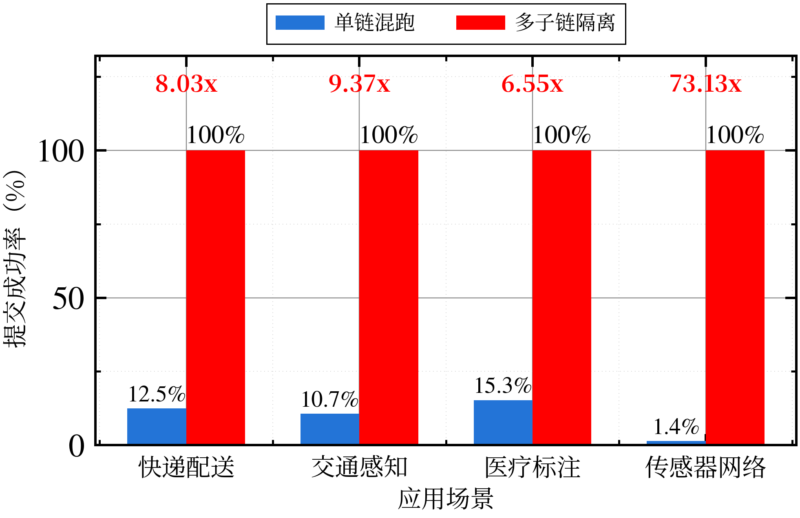
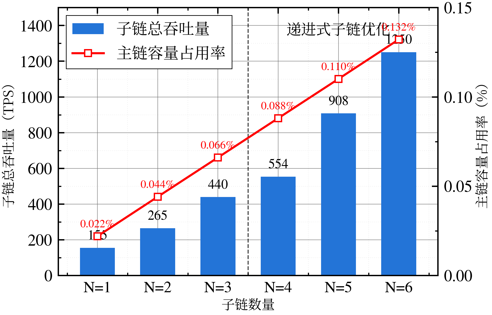
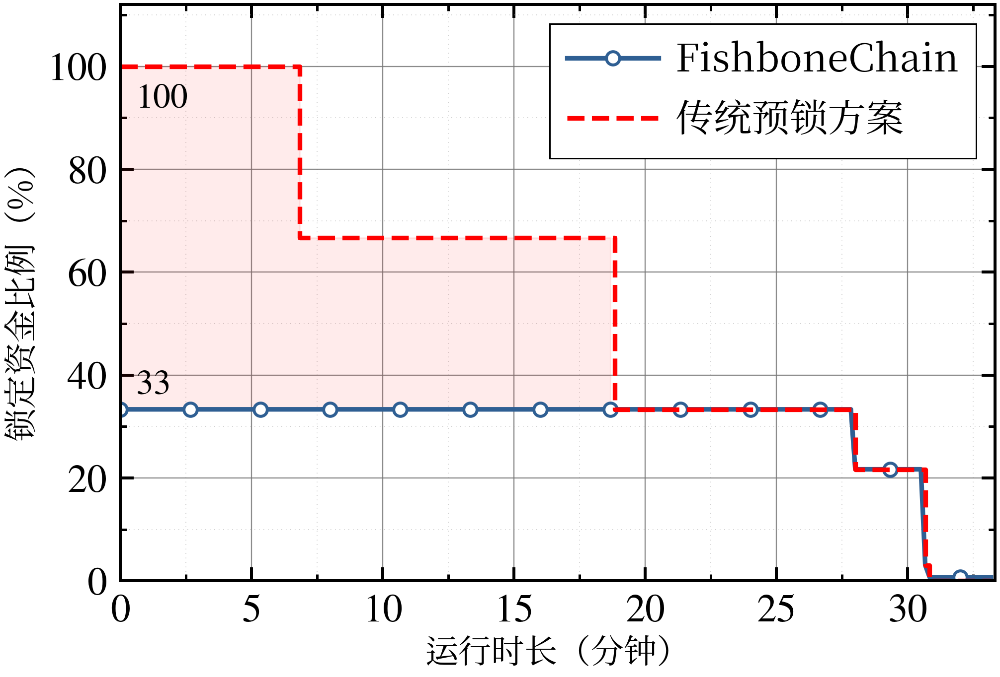
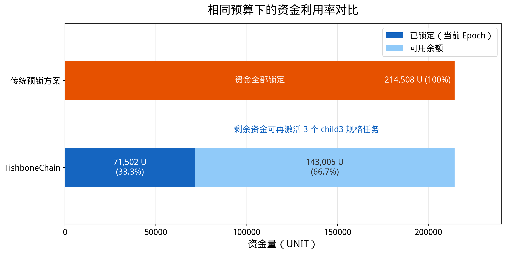

# 5. 性能评估

## 5.1 实验设置

为了评估安全可扩展的多链数据流通平台在复杂数据流通场景中的性能表现，本文基于 Substrate区块链开发平台 实现了 FishboneChain 原型系统。原型系统包含一条主链和多条子链，其中子链负责处理高频数据流通请求，主链负责维护全局状态、接收子链在 epoch 结束时提交的摘要信息，并执行跨链协调和结算相关操作。实验运行在 18 台 x86_64 Linux 虚拟机组成的集群上，每台虚拟机配置 8核CPU、16 GB 内存和100GB 磁盘，节点之间通过千兆内网连接。其中，f1-f12 运行 Debian GNU/Linux 13（trixie），内核版本为 Linux 6.12.86+deb13-amd64；f13-f18 运行 Ubuntu 22.04.5 LTS，内核版本为 Linux 5.15.0-181-generic。主链和子链均采用多验证节点部署，并分别部署了substrate自有的AURA和BABE共识算法。
实验负载来自四类具有代表性的数据流通工作负载，包括快递配送、交通感知、医疗标注和传感器网络。这些负载在提交频率、任务数量、奖励预算和数据体量方面存在明显差异，其中交通感知和传感器网络代表高频小额数据流通请求，医疗标注代表低频高价值数据交易请求。该设置可以覆盖高并发、多角色、需求复杂的数据流通场景，也可作为可验证脱敏数据交易和跨链状态证明等上层应用的压力模型。为展示不同架构下的性能差异，本文设置了两类对比场景：第一类是共享链场景，即多类数据流通请求在同一条链上竞争同一提交容量；第二类是多子链隔离场景，即不同类型的请求被部署到独立子链上，分别使用各自的链上容量。对于资金效率评估，本文将 FishboneChain的统一资金管理机制与传统预锁方案进行对比。传统预锁方案要求在任务开始前一次性锁定整个计划期的预算，而本研究仅锁定当前 epoch 所需预算，并在任务完成后释放资金。

本文主要从两方面评估系统性能。首先，在链上处理能力方面，使用请求提交成功率评估异质数据流通负载之间的资源竞争情况，使用子链聚合吞吐量评估多子链横向扩展能力，并使用主链容量占用率评估子链扩展对主链造成的压力。主链容量占用率定义为子链桥接交易理论吞吐量与主链实测最大吞吐量的比值。实验中 epoch 长度为 120 秒，每条子链每个 epoch 产生 2 笔桥接 extrinsic，主链在 18 节点 transfer 压测下的最大吞吐量为 75.66 TPS。其次，在资金效率方面，使用锁定资金比例和同等预算下可支持的数据流通任务组数量评估 FMC 对资金流动性的提升。

## 5.2 子链隔离与吞吐扩展

首先评估共享链场景下异质数据流通请求之间的资源竞争问题。为此，本文将四类工作负载部署在同一条链上，并设置每个 epoch 的总提交容量为 1000 次。在该设置下，所有请求共享同一链上提交容量。当高频数据流通请求在短时间内持续提交时，低频但高价值的数据交易请求也可能因共享容量被提前耗尽而无法完成提交。图 1 展示了单链混跑和多子链隔离两种场景下的提交成功率。

图 1 跨场景隔离效果对比

从图 1 可以看出，在单链混跑场景下，快递配送、交通感知、医疗标注和传感器网络的提交成功率分别为 12.46%、10.67%、15.26% 和 1.37%。该结果说明，当异质数据流通请求共享同一链上容量时，高频请求会显著挤占其他请求的提交机会，尤其会影响低频高价值数据交易的服务质量。这一现象反映了单链架构在面对复杂数据流通负载时的扩展性不足：即使总容量没有被不同业务公平使用，所有请求仍需要在同一个容量上限内竞争。

随后评估多子链隔离对资源竞争的缓解效果。将四类负载分别部署到独立子链后，各类请求不再竞争同一提交容量，而是在各自子链内部完成调度和执行。由图 1 可见，多子链隔离后四类负载的提交成功率均达到 100%。与单链混跑相比，快递配送、交通感知、医疗标注和传感器网络分别获得 8.03 倍、9.37 倍、6.55 倍和 73.13 倍的提升。该结果表明，多子链结构能够将异质数据流通请求之间的直接容量竞争转化为不同子链上的独立处理，从而避免高频请求挤占低频请求。对于数据流通平台而言，这一性质意味着系统可以根据数据类型、业务角色或验证需求划分链上资源，使不同数据流通任务获得相对稳定的执行环境。

在验证多子链隔离能够消除资源竞争后，进一步评估系统的横向扩展能力。实验逐步增加活跃子链数量，并统计所有子链接受的数据流通请求总量。图 2 展示了 N=1 至 N=6 条子链并发运行时的聚合吞吐量以及对应的主链容量占用率。N=1 时，系统吞吐量为 155 TPS；当子链数量增加至 2 和 3 时，聚合吞吐量分别达到 265 TPS 和 440 TPS，说明在相似子链配置下，系统能够通过增加子链获得接近线性的吞吐提升。在 N=4 至 N=6 阶段，本文进一步引入递进式运行时优化，包括减少高频提交路径中的事件开销、优化链上存储结构以及支持批量提交。最终，N=6 时系统聚合吞吐量达到 1250 TPS，相比单子链提高约 8.05 倍。

图 2 子链总吞吐量与主链容量占用率

图 2 同时给出了主链容量占用率。随着子链数量从 1 增加到 6，主链容量占用率从 0.022% 增加到 0.132%，始终低于 0.14%。该结果说明，多子链扩展并未使主链成为系统瓶颈。其原因在于，FishboneChain 并不要求主链处理每一笔高频数据流通请求，而是由子链在本地处理业务交易，再由主链接收 epoch 级的聚合摘要、跨链状态同步和结算交易。因此，主链负载主要随子链数量和 epoch 频率增长，而不是随数据流通请求数量线性增长。综上，FishboneChain 通过多子链隔离解决了异质数据流通任务之间的容量竞争问题，并通过多子链并行处理提高了系统总吞吐量，同时保持主链负载处于较低水平。

## 5.3 资金流动性提升

除了链上吞吐能力外，数据流通平台还需要考虑交易资金和任务预算的占用效率。传统预锁方案通常要求数据请求者在交易或任务启动前锁定整个计划期内的全部预算。该方式实现简单，但当数据流通周期较长或并发任务数量较多时，会造成大量资金在任务执行期间无法被重新利用。FishboneChain 的 FMC 机制采用 epoch 粒度的资金锁定方式，仅锁定当前 epoch 所需预算，并在数据流通任务完成或进入结算阶段后释放相应资金。为评估该机制的效果，本文部署 6 个活跃数据流通任务，单个 epoch 的预算总和为 71502.5 UNIT，并以 3 个 epoch 作为基本计划期。图 3 展示了两种方案的锁定资金比例随时间变化情况。

图 3 锁定资金比例随时间变化

如图 3 所示，传统预锁方案在任务开始时需要一次性锁定 214507.5 UNIT，因此在整个计划期内锁定比例保持为 100%。相比之下，FMC 在初始时仅锁定当前 epoch 的 71502.5 UNIT，锁定比例为 33.3%。随着任务执行和结算推进，部分已完成任务的资金被释放回可用资金池，使锁定资金比例继续下降。该结果表明，FMC 不仅降低了数据流通任务启动时所需的瞬时资金占用，而且能够根据任务执行进度逐步释放资金。对于持续运行的数据流通平台而言，这种机制可以减少资金闲置时间，使已释放资金继续用于后续数据交易、验证服务或跨链流通任务。

进一步地，本文从同等总预算下的资金占用结构评估 FMC 的资金效率。图 4 使用与图 3 相同的 6 个数据流通任务，并以 3 个 epoch 计划期下传统预锁方案所需的总预算 214507.5 UNIT 作为对比基准。传统预锁方案需要在任务启动时将全部资金锁定，因而可用余额为 0。相比之下，FishboneChain 仅需锁定当前 epoch 的预算 71502.5 UNIT，占总预算的 33.3%，剩余 143005 UNIT 仍保持可用，占总预算的 66.7%。

图 4 同等预算下的资金利用率对比

图 4 更直观地展示了 FMC 对资金流动性的提升。在相同资本投入下，传统预锁方案将资金全部转化为锁定状态，无法继续支持新的数据交易或验证服务；而 FishboneChain 在保证当前 epoch 任务执行的同时，仍保留三分之二以上的可用余额。以实验中 child3 规格任务为例，该部分余额还可以继续激活 3 个同规格任务。图 3 和图 4 分别从时间维度和资金结构维度说明了 FMC 的作用：前者表明资金会随任务推进动态释放，后者表明释放出的资金能够立即转化为平台继续承载任务的能力。综合上述实验，第三个研究点提出的多链数据流通平台能够为前两个研究点提供可扩展的运行基础：一方面，不同类型的数据交易、状态证明和流通任务可以通过子链隔离获得独立处理能力；另一方面，主链仅承担聚合状态、跨链协调和结算功能，从而避免成为高频业务瓶颈。
