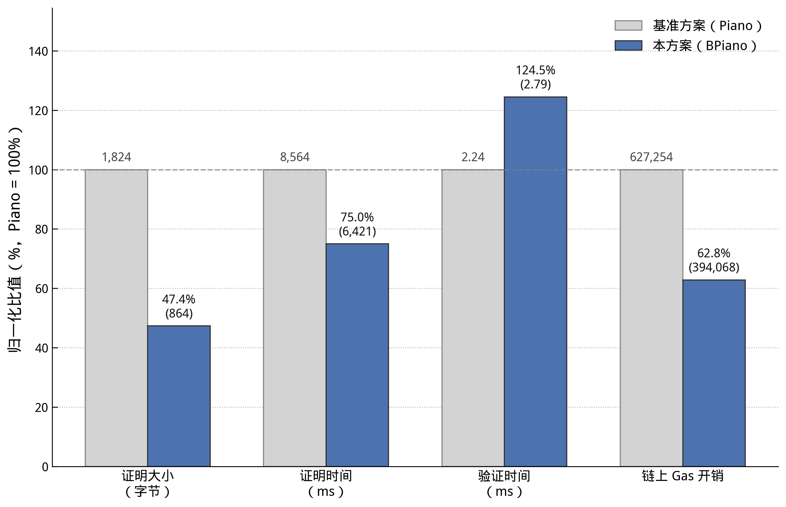
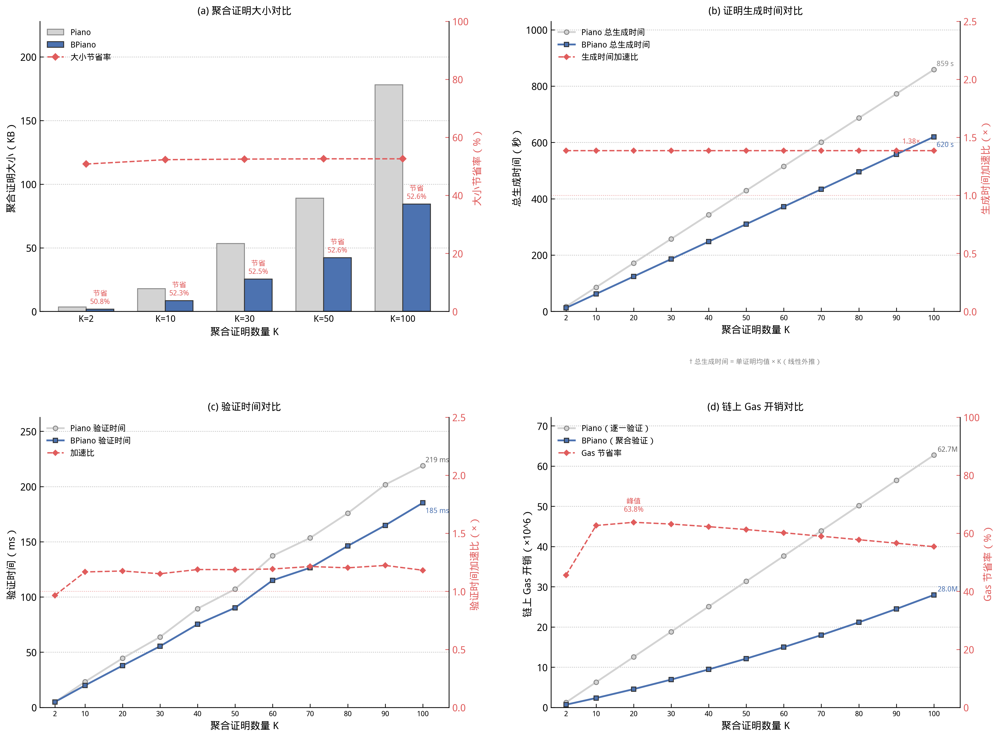

# 高效验证的跨链状态证明协议

## 摘要
数据的跨域流通对于释放数据价值具有重要意义。随着公开、透明、不可篡改的区块链技术的不断成熟和落地，各领域都建设和部署了联盟链或私有链系统为其数据进行管理和背书。然而这些系统之间架构不同且互不信任，难以进行高效的数据跨域流通。简洁非交互零知识证明（Zero Knowledge Succinct Non-interactive ARgument of Knowledge, zk-SNARK）的不依赖可信第三方，一次证明生成即可高效验证的性质十分契合分布式且计算资源受限的区块链场景。近年来，针对跨链状态证明这类电路规模巨大的场景提出了分布式零知识证明技术，由一个主节点完成电路分割并将其分配给多个子节点并行执行计算，最后由主节点聚合，从而提高零知识证明的生成效率。但是这些工作都将工作重心放在了提高证明生成效率和降低子节点通信开销上，对证明的验证开销的重视不足。由于区块链的存储和计算资源都是有限的，每一次密码学计算都很昂贵，高开销的证明验证也影响了零知识证明这一技术在区块链系统中的应用。本文提出了新的分布式零知识证明，通过由主节点提前完成一部分验证工作来实现常数级的证明验证时间和证明大小。理论和实验分析证明了本方案在没有损失安全性的前提下，提高了证明的验证效率。
## 引言
在数字经济蓬勃发展的时代浪潮中，数据要素已明确成为继土地、劳动力、资本、技术之后的第五大生产要素，其战略地位日益凸显，是驱动经济社会数字化转型和高质量发展的核心动能。努力为庞大规模的数据进行价值释放既是国家新时代战略发展布局的一部分，更是时代发展的必然要求。数据的价值实现高度依赖于具体的应用场景，不同维度数据的组合能够在特定场景中实现价值的几何级增长。这种场景依赖性为数据要素的价值挖掘提供了无限可能，通过数据的重组、融合和深度分析，可以在医疗、金融、交通、教育等各个领域创造出新的价值。因此，数据的跨域流通是数据价值释放必不可少的手段。区块链技术的公开、透明、不可篡改的特性，为数据生产、治理和流通的全生命周期管理和存证提供了强有力的支持。现如今的大部分领域通常都结合其自身需求，建设和部署了其专属的联盟链或私有链系统，从而对其专有数据进行管理和存证。然而，不同区块链系统之间互通困难，从而形成了大量只包含各自领域数据的数据孤岛，这极大的阻碍了数据价值的释放。

针对区块链间互通困难导致的数据孤岛问题，现有的解决方案存在安全和效率问题。跨链委员会[1][2]是目前应用较为广泛的解决方案之一，其核心思想是来自不同区块链系统的多个验证节点组成跨链委员会，对需要进行跨链验证的状态信息进行集体投票，达到投票阈值后，聚合所有节点的签名，从而形成对这种状态的统一背书。这种方案虽然简单易用，可操作性强，但也存在明显的安全缺陷。委员会模式具有较高的中心化程度，其相比于分布式的区块链而言，更容易被攻击者选择成为破坏整个系统的突破口。另一方面，验证效率会收到委员会规模的直接影响，若委员会规模较小，则效率更高但安全性有所降低，若规模较大则会降低状态背书效率。另一种解决思路是中继链技术[3][4]，即构建一个统一的中继区块链作为各个区块链之间沟通的桥梁，每个区块链都需要将其最新区块链信息提交到中继链，由中继链的验证节点负责检验和维护每个区块链的状态有效性，为后续的跨链证明做准备。然而，这种方案也存在着明显的技术瓶颈。需要在原有分散的区块链系统的基础上，构建一个额外的共识机制来保证中继链本身的安全性和一致性。这增加了系统的复杂度，且由于区块链系统存在吞吐量上限，整个系统所能接入的区块链数量也就存在上限，这大大限制了整个系统的灵活度。

基于 zk-SNARK[1][6]的跨链状态证明是近年来最新的发展方向，该技术的核心优势包括：无可信第三方、隐私保护和高效验证。零知识证明协议中，仅包含证明者和验证者，证明者能够在不向验证者透露任何隐私数据（如交易具体内容）的前提下，通过数学手段使验证者确信某个计算状态转移的正确性。特别是 zk-SNARKs（Succinct Non-interactive Argument of Knowledge），其具备“简洁性”（Succinctness）的核心优势，生成的证明大小通常仅为几百字节，且验证时间极短，与计算规模呈对数关系甚至常数关系。这意味着链上节点无需重新执行复杂的智能合约交易，仅需校验一个小型的加密证明即可确认海量交易的有效性。这种非交互、低带宽占用且保护隐私的特性，使其成为构建去中心化、无需许可的跨链桥和区块链扩容方案的理想技术底座。简洁非交互零知识证明在区块链扩容和隐私保护的方面有着广泛应用。一方面是区块链扩容，利用 zk-SNARK 的简洁性即无论证明电路如何庞大，证明大小和验证复杂度都是常数级的特点，为大量链下交易的正确性生成证明，链上智能合约无需重复执行交易流程，仅需验证证明的正确性即可完成上链，如 zkRollup[7]。另一方面用于隐私保护，利用 zk-SNARK 的零知识性，保护链上交易信息如交易金额，交易双方身份信息等，如最早应用 zk-SNARK 到加密货币领域的 ZeroCash[8]。

然而直接将 zk-SNARK 技术应用到跨链状态证明场景中，存在明显的效率问题。跨链状态证明要求目标链能够完整验证原区块链中的状态存储逻辑从而验证相关数据的真实性与完整性，而区块链系统大多采用默克尔树的某种变体如默克尔哈希树或默克尔前缀树等进行状态数据存储，该类数据结构具有维护简便、更新高效且支持动态扩容的优势，但其内置的哈希函数多包含大量非线性运算，这类运算在零知识证明电路中会产生大规模的电路约束，同时为实现全量状态存储，默克尔树的平均深度通常在 10-20 层之间，且随着链上状态量的增加，深度可能进一步提升。因此跨链状态证明的电路规模通常很大，且证明生成过程涉及大量的多项式运算，因此需要利用快速傅里叶变换（Fast Fourier Transform，FFT）和多标量乘法（Multi-Scalar Multiplication，MSM），计算开销极大，并很容易触发内存溢出。针对这一瓶颈，Wu 等人[9]最早提出了分布式零知识证明方案，这类方案的基本思路是把大规模电路拆分为多个子电路，在多个子计算节点中并行执行计算，从而实现证明生成的线性扩展。但是，现有的分布式方案[9][10][12][14][15]主要聚焦于优化证明生成时间和子节点间的通信开销，在一定程度上忽视了证明的验证开销在区块链环境下的敏感性。即使现有的分布式零知识证明的验证开销与证明电路规模呈对数关系或常数关系，但由于区块链的计算资源敏感的特性，每一次密码学相关运算都会消耗算力，而相关的分布式零知识证明工作对这一点缺乏足够的重视，限制了分布式零知识证明在跨链状态证明场景中的应用。

为了解决上述问题，本文提出了一种基于 Pianist 协议的高效验证方案。本方案的核心目标是在保留 Pianist 分布式零知识证明架构的线性扩展性和低通信量优势的前提下，通过密码学原语的优化组合，显著降低链上存储和验证成本。具体而言，我们引入了两层核心优化：首先，通过多项式聚合将单次证明中涉及的多个多项式承诺开启聚合为一次，从而缩减单个证明的体积；其次，利用 KZG 承诺[13]的加法同态性实现跨证明聚合，将一段时间内产生的多个跨链状态证明聚合成一个批量证明，从而进一步降低链上开销。

本文的主要贡献总结如下：

(1) **提出了支持分布式生成的证明压缩方案**：基于 Shplonk 的多点聚合技术，我们在 Pianist 的双变量约束系统之上设计了兼容分布式环境的多项式聚合算法。该算法通过将不同挑战点（$\alpha$ 和 $\omega_X\alpha$）的多个多项式开启证明聚合为单个承诺，实现了 X 轴和 Y 轴的两层聚合优化。子节点先在本地并行计算聚合商多项式并生成承诺，主节点收集后进行全局聚合，最终通过配对合并技术将验证复杂度保持在常数级，显著降低了单个证明的体积和链上验证开销。

(2) **设计了基于共享挑战点的证明批量聚合机制**：利用 KZG 承诺的加法同态性，我们提出了一种将多个跨链状态证明聚合为单个批量证明的方案。通过两轮挑战协调协议确保 $K$ 个证明共享相同的挑战点 $\alpha$ 和 $\beta$，并利用随机线性组合将 $K$ 个配对验证等式聚合为一个，从而将批量验证的配对运算次数从 $O(K)$ 降至 $O(1)$，实现了验证开销的次线性增长。

(3) **提供了完整的安全性证明和性能分析**：我们形式化证明了证明压缩和批量聚合机制在代数群模型和随机预言机模型下满足完备性、知识可靠性和零知识性。理论分析表明，方案在保持证明生成时间复杂度 $O(T\log T)\mathbb{F} + O(T)\mathbb{G}$ 和通信复杂度 $O(M)|\mathbb{G}|$ 与原始 Pianist 协议一致的前提下，将单个证明的验证复杂度维持在 $O(1)\mathbb{P}$，批量验证的平均每证明配对开销降至 $O(1/K)\mathbb{P}$，在不牺牲安全性的情况下显著提升了跨链状态证明在区块链环境中的实用性。
## 相关工作
针对跨链状态证明这类超大规模电路的证明生成效率低的问题，学术界提出了一系列分布式零知识证明方案。最早的分布式零知识证明系统之一是 Wu 等人提出的 DIZK[9]。DIZK 基于 Groth 16[1]协议，在分布式集群上实现了配对友好型 SNARK 的并行计算。它通过分布式执行 FFT 和 MSM，成功将证明生成扩展到了数十亿门的电路规模。然而，DIZK 的局限性在于其通信复杂度与电路规模成线性关系，导致在带宽受限的网络环境下性能急剧下降。更关键的是，DIZK 的验证开销和证明大小并未针对区块链场景进行优化，其依赖的公共参考串（Common Conference String, CRS）长度和验证计算量依然较大，难以满足区块链这种计算开销极为敏感的场景需求。

为了克服通信瓶颈，Xie 等人提出了 deVirgo[10]，其以无需可信设置的 Virgo 协议[11]为基础，依托数据并行电路的结构特性，设计了分布式 sumcheck 协议与聚合式多项式承诺方案，通过主节点汇总各子证明者的局部多项式结果，既实现了证明生成的线性加速，又避免了朴素分布式方案中证明大小随子电路数量线性增长的弊端。然而，deVirgo 在优化证明端并行效率的同时，未能原生适配链上验证场景，其底层采用 Virgo 的基于 Merkle 树与 FFT 计算的多项式承诺机制，生成的原始证明大小约 210 KB 且链上直接验证需消耗近 80 M gas，远超区块链单块 Gas 限制，无法直接部署于智能合约。为了实现链上的高效验证，不得不使用 Groth 16 协议[1]在 deVirgo 的基础上进行了一次递归证明，这虽然解决了链上验证开销问题，但增加了证明生成时间和复杂度。

Liu 等人提出了基于 Plonk 协议[6]的 Pianist 协议[11]，将原 Plonk 中的单变量多项式扩展成双变量，子电路仅负责对 X 轴维度的多项式计算对应的承诺和证明，主节点收到对应子电路的承诺和证明后，再对 Y 轴维度多项式进行承诺和证明，并针对性地将原 Plonk 协议中的 KZG 承诺[13]转换为分布式 KZG 承诺 (DKZG)。从而实现了常数级的证明大小和常数级的验证时间。Hekaton [14]的核心技术特点是提出了 divide-and-aggregate 框架，将大电路拆分为子电路并行证明后聚合为单一简洁证明，通过高效全局内存技术处理子电路间共享线，支持任意计算且水平扩展性强，能高效适配可验证密钥目录和 RAM 计算等实际应用。其不足之处在于证明过程仍存在准线性成本，声称的相对于 Pianist 的 3 倍加速比被 HyperPianist[15]指出可能被高估，实际约 2 倍，且证明大小和验证时间随子电路数量对数增长。基于 HyperPlonk[16]的分布式版本 HyperPianist[15] 通过多变量多项式进一步优化了证明生成速度，但其验证开销退化为对数级。为了更加清晰的对比各类证明方案，我们给出了各个方案的性能对比，其中 $N$ 代表见证者规模， $M$ 为分布式部署的机器数量，$T=N/M$ 表示单台机器持有见证者的规模； $\mathbb{F}$ 表示有限域， $\mathbb{G}$ 表示椭圆曲线群（如 $\mathbb{G}_1,\mathbb{G}_2$ ）， $\mathbb{P}$ 表示配对运算， $\mathbb{H}$ 表示哈希函数， $\mathbb{G}_T$ 表示配对目标群， $|\cdot|$ 表示对应类型元素的编码/存储/传输大小

| 方案                      | 设置方式 | 证明时间                                  | 验证时间                                                     | 证明大小                                                             | 通信复杂度                                                                   |
| ----------------------- | ---- | ------------------------------------- | -------------------------------------------------------- | ---------------------------------------------------------------- | ----------------------------------------------------------------------- |
| deVirgo                 | 透明设置 | $O(T\log T)\mathbb{F}+O(T)\mathbb{H}$ | $O({\log ^2}N + M)\mathbb{H}$                            | $O({\log ^2}N + M)\                    |\mathbb{H}\|$                                | ${\text{O(N) }}\                    |\mathbb{F}\|$                                          |
| Pianist                 | 可信设置 | $O(T\log T)\mathbb{F}+O(T)\mathbb{G}$ | $O(1)\mathbb{P} + O(\log N)\mathbb{F}$                   | $o(1)\                    |\mathbb{G}\|$                                             | $o(M)\                    |\mathbb{G}\|$                                                    |
| HEKATON                 | 可信设置 | $O(T\log T)\mathbb{F}+O(T)\mathbb{G}$ | $O(\log M)\mathbb{G}$                                    | $O(\log M)\                    |\mathbb{G}\|$                                        | $o(M)\                    |\mathbb{G}\|$                                                    |
| $\text{HyperPianist}^K$ | 可信设置 | $O(T)\mathbb{F}+O(T)\mathbb{G}$       | $O(\log N)\mathbb{F} + O(\log N)\mathbb{P}$              | $O(\log N)\                    |\mathbb{F}\| + O (\log N)\|\mathbb{G}\|$              | $O(M \cdot \log N)\                    |\mathbb{F}\| +O (M \cdot \log N)\|\mathbb{G}\|$      |
| $\text{HyperPianist}^D$ | 透明设置 | $O(T)\mathbb{F}+O(T)\mathbb{G}$       | $O(\log N)\mathbb{F} + O(\log N + \log M){\mathbb{G}_T}$ | $O(\log N)\                    |\mathbb{F}\| + O (\log N + \log M)\|{\mathbb{G}_T}\|$ | $O(M \cdot \log N)\                    |\mathbb{F}\| + O (M \cdot \log N)\|{\mathbb{G}_T}\|$ |

## 预备知识

### 区块链和智能合约
区块链作为一种基于分布式网络构建的去中心化账本技术，核心特征在于利用共识机制和密码学算法实现了数据在存在不可信节点下的不可篡改性和一致性。以太坊[17]作为第二代区块链系统的代表，引入了图灵完备的智能合约技术，允许用户在区块链上部署和执行任意逻辑的代码，代码执行的正确性由参与共识的节点保障。近年来，通过不断地发展，智能合约支持了各种密码学验证功能，其中就包括了对两种经典零知识证明协议 Groth 16 和 Plonk，这为基于 zk-SNARK 技术开发相关基于区块链的功能提供了保障。然而，对于每个共识节点都要执行一遍来验证正确性的智能合约，每一次的密码学运算都对区块链的性能提出了挑战。

### 间接非交互零知识证明

洁非交互式零知识证明（zk-SNARK）允许证明者向验证者证明某个陈述为真，而无需向验证者泄露除该陈述意外的任何信息。形式化的，对于一个关系，zk-SNARK 包含一组算法 ：$(\mathsf{Setup,Prove,Verify})$

 $\mathsf{Setup}(\lambda)\rightarrow (pk,vk)$基于安全参数，生成证明密钥和验证密钥。

 $\mathsf{Prove}(pk,x,w)\rightarrow \pi$：对于公共输入和私有见证（witness） ，若，则生成证明。

 $\mathsf{Verify}(vk,\pi)\rightarrow \{0,1\}$：验证证明的有效性。

Zk-SNARK 必须满足的三个性质：完备性、知识可靠性和零知识性。其中完备性为诚实的证明者和有效的见证，一定能生成正确的证明，被验证者接受。知识可靠性是指恶意证明者在没有有效见证的前提下，无法生成有效证明。针对同一个承诺给出的两个证明，存在多项式时间的提取算法，能够从中提取出见证。零知识性则是存在一个概率多项式时间的模拟器 S，其可以在没有有效见证的前提下，生成与真实证明者-验证者交互不可区分的视图。

### 分布式 KZG 承诺

Pianist 协议中提出了针对二元多项式 $F(Y,X) = \Sigma_{i=0}^{M-1}\Sigma_{j=0}^{T-1}f_{i,j}R_i(Y)L_j(X)$ 的分布式承诺方案 (Distributed KZG, DKZG)。其中主节点为 $\mathcal{P}_0$，子节点 $\mathcal{P}_i$ 持有一元多项式 $f_i(X) = \Sigma_{j=0}^{T-1}f_{i,j}L_j(X)$，即二元多项式在第 $i$ 个 $Y$ 维度分片的 $X$ 维度多项式，$R_i(Y)$ 为 $M$ 次单位根定义的 $Y$ 轴拉格朗日基多项式，$L_j(X)$ 为 $T$ 次单位根定义的 $X$ 轴拉格朗日基多项式。DKZG 承诺包含四个算法：$\text{(KeyGen,Commit,Open,Verify)}$：

- $\text{KeyGen}(1^\lambda,M,T) \to pp$ ：输入安全参数 $1^\lambda$、节点数 $M$、子电路规模 $T$，生成公共参数 $pp$
- $\text{Commit}(F(Y,X),pp) \to com_F$ ：输入二元多项式 $F(Y,X)$、公共参数 $pp$，输出对 $F$ 的承诺 $com_F$ 。其主要流程为子节点 $\mathcal{P}_i$ 先对其 $f_i(X) = \Sigma_{j=0}^{T-1}f_{i,j}L_j(X)$ 进行承诺给出 $com_{f_i}$ ，主节点 $\mathcal{P}_0$ 收集所有子节点的承诺并将其聚合 $com_F = \prod_{i=0}^{M-1}com_{f_i}$ 。
- $\text{Open}(F(Y,X),\alpha,\beta,pp) \to (f(\beta,\alpha),\pi_0,\pi_1)$ ：输入待打开的二元多项式 $F(Y,X)$、$Y$ 轴打开点 $\beta$ 和 $X$ 轴打开点 $\alpha$、公共参数 $pp$，输出多项式在打开点的取值 $z = f(\beta,\alpha) \in \mathbb{F}$、打开证明 $\pi_0,\pi_1$。
- $\text{Verify}(com_F,\beta,\alpha,F(\beta,\alpha),\pi_0,\pi_1,pp) \to \{0,1\}$：输入二元多项式的全局承诺 $com_F$、打开点 $(\beta,\alpha)$、多项式取值 $F(\beta,\alpha)$、打开证明 $\pi_0,\pi_1$，输出验证结果 $b \in \{0,1\}$。
## 4 高效验证的跨链状态证明方案
本节先介绍 Pianist 协议的方案内容和基本流程，在此基础上给出我们的证明压缩和证明聚合方案。

### 4.1 Pianist 协议概述
Pianist 方案采用“主节点+子节点”的分布式架构，系统包含 $M$ 个计算节点 $\mathcal{P}_0,\mathcal{P}_1,...,\mathcal{P}_{M-1}$，其中 $\mathcal{P}_0$ 为主节点负责参数分发、证明聚合与交互，$\mathcal{P}_1 \sim \mathcal{P}_{M-1}$ 为子节点，负责本地子电路计算。总电路规模为 $N$，将总电路拆分为 $M$ 个独立子电路 $C_0,C_1,...,C_{M-1}$，每个子电路规模 $T = N/M$。

子电路 $C_i$ 的约束系统继承自 Plonk，由门约束和复制约束两部分组成。门约束通过引入选择器多项式 $q_{a,i}(X), q_{b,i}(X), q_{o,i}(X), q_{ab,i}(X), q_{c,i}(X)$，将 $T$ 个逻辑门经拉格朗日插值统一表示为多项式等式 $g_i(X) := q_{a,i}a_i + q_{b,i}b_i + q_{ab,i}a_ib_i + q_{o,i}o_i + q_{c,i} = 0$，其中 $a_i(X), b_i(X), o_i(X)$ 为见证多项式。复制约束通过置换 $\sigma$ 刻画线路连接：引入随机挑战 $\eta, \gamma$ 和累加多项式 $z_i(X)$，将连线正确性转化为两个递推多项式约束 $p_{i,0}(X) = L_0(X)(z_i(X)-1) = 0$ 与 $p_{i,1}(X) = z_i(X)f_i(X) - z_i(\omega_X X)f_i'(X) = 0$，其中 $f_i(X), f_i'(X)$ 分别为含置换多项式和单位根陪集的乘积多项式。引入随机数 $\lambda$ 将两类约束聚合，子电路的正确性等价于商多项式等式 $g_i(X) + \lambda p_{i,0}(X) + \lambda^2 p_{i,1}(X) = V_X(X)h_i(X)$ 成立，其中 $V_X(X) = X^T - 1$。

主节点将 $M$ 个子电路的单变量多项式 $w_i(X)$ 通过 $Y$ 轴拉格朗日基函数 $R_i(Y)$ 提升为二元多项式 $W(Y,X) = \Sigma_{i=0}^{M-1} R_i(Y)w_i(X)$，从而将所有子电路约束聚合为统一的二元恒等式：
$$G(Y,X) + \lambda P_0(Y,X) + \lambda^2 P_1(Y,X) - V_X(X)H_X(Y,X) = V_Y(Y)H_Y(Y,X)$$
其中 $P_0(Y,X) = L_0(X)(Z(Y,X)-1)$，$P_1(Y,X) = Z(Y,X)\prod_{S}(S+\eta\sigma_S+\gamma) - Z(Y,\omega_X X)\prod_{S}(S+\eta k_S X+\gamma)$，$V_Y(Y) = Y^M - 1$，$H_X(Y,X)$ 与 $H_Y(Y,X)$ 分别为 $X$ 轴与 $Y$ 轴商多项式。验证 $M$ 个子电路的正确性等价于验证该二元恒等式成立。

### 4.1.3 Pianist 协议流程

Pianist 协议流程分为初始化、承诺、证明、输出、验证五个阶段。

(1) 初始化。 主节点执行 $\text{DKZG.KeyGen}(1^\lambda,M,T)$ 生成公共参数 $pp$，包含 $\mathbb{G}_1$ 元素矩阵 $\mathbf{U} = (g^{R_i(\tau_Y)L_j(\tau_X)})$、列向量 $\mathbf{V} = (g^{R_i(\tau_Y)})$ 及陷门 $\tau_X, \tau_Y$（生成后销毁）；预计算公共多项式集合 $S_{pp}$ 的全局承诺 $com_{S_{pp}}$；将子电路结构信息分发至各子节点，生成证明密钥 $pk_i$ 与验证密钥 $vk = (g^{\tau_X}, g^{\tau_Y}, com_{S_{pp}})$。

(2) 承诺阶段。 各子节点 $\mathcal{P}_i$ 并行插值得到见证多项式 $a_i(X), b_i(X), o_i(X)$，计算本地承诺 $com_{a_i} = \Pi_{j=0}^{T-1} U_{i,j}^{a_{i,j}}$ 及 $com_{b_i}, com_{o_i}$，发送至 $\mathcal{P}_0$；$\mathcal{P}_0$ 聚合得 $com_A = \Pi_{i=0}^{M-1} com_{a_i}$，同理得 $com_B, com_O$，经 Fiat-Shamir 变换派生挑战 $\eta, \gamma$ 并分发。各子节点计算置换累加多项式 $z_i(X)$ 的本地承诺 $com_{z_i}$ 发送至 $\mathcal{P}_0$，聚合得 $com_Z$，派生挑战 $\lambda$ 并分发。各子节点计算商多项式 $h_i(X)$ 的本地承诺 $com_{h_i}$ 发送至 $\mathcal{P}_0$，聚合得 $com_{H_X}$（因次数为 $3T-2$，分三部分存储）。

(3) 证明阶段。 $\mathcal{P}_0$ 派生 X 轴挑战 $\alpha$ 并分发；各子节点在 $\alpha$ 和 $\omega_X\alpha$ 处对本地多项式生成取值和 DKZG 开启证明，发送至 $\mathcal{P}_0$；$\mathcal{P}_0$ 聚合得全局取值多项式 $A(Y,\alpha), B(Y,\alpha), O(Y,\alpha), Z(Y,\alpha), Z(Y,\omega_X\alpha), H_X(Y,\alpha)$ 及全局开启证明，并计算 $H_Y(Y,\alpha)$ 的承诺 $com_{H_Y}$。$\mathcal{P}_0$ 再派生 Y 轴挑战 $\beta$，对上述多项式在 $\beta$ 处求值并生成 Y 轴开启证明 $\pi_{1,\cdot}$，得到最终标量求值 $A(\beta,\alpha), B(\beta,\alpha), O(\beta,\alpha), Z(\beta,\alpha), H_X(\beta,\alpha), H_Y(\beta,\alpha), Z(\beta,\omega_X\alpha)$。

(4) 输出。 最终证明 $\pi$ 包含承诺部分 $\{com_A, com_B, com_O, com_Z, com_{H_X}, com_{H_Y}\}$，第一层开启证明 $\{\pi_{0,A}, \pi_{0,B}, \pi_{0,O}, \pi_{0,Z}, \pi_{0,H_X}, \pi_{0,Z}'\}$，第二层开启证明 $\{\pi_{1,A}, \pi_{1,B}, \pi_{1,O}, \pi_{1,Z}, \pi_{1,H_X}, \pi_{1,H_Y}, \pi_{1,Z}'\}$，以及求值部分共 7 个标量。

(5) 验证阶段。 验证者首先重算 Fiat-Shamir 挑战 $\eta, \gamma, \lambda, \alpha, \beta$；随后对承诺与开启证明执行双线性配对检查，验证 $e(com_S / g^{S(\beta,\alpha)}, g) = e(\pi_{0,S}, g^{\tau_X-\alpha}) \cdot e(\pi_{1,S}, g^{\tau_Y-\beta})$ 对所有 $S \in S_{pp} \cup \{A,B,O,Z,H_X,H_Y\}$ 成立，对偏移点 $(\beta,\omega_X\alpha)$ 类似验证；最后将求值代入聚合恒等式，验证等式 $G(\beta,\alpha) + \lambda P_0(\beta,\alpha) + \lambda^2 P_1(\beta,\alpha) - V_X(\alpha)H_X(\beta,\alpha) = V_Y(\beta)H_Y(\beta,\alpha)$ 是否成立。

## 4.2 证明压缩

Pianist 协议中，每个多项式的开启证明包含针对 $\alpha$ 和 $\omega_X\alpha$ 两个挑战点的独立 DKZG 承诺，导致证明大小与多项式数量线性相关。受 Shplonk [19] 启发，本节提出证明压缩方案，通过三个步骤压缩证明体积：X 轴多点聚合将两个挑战点处的多项式聚合为一个商多项式，从而仅需生成一个承诺；Y 轴批量聚合将需在 $\beta$ 处开启的多项式进一步合并为单一多项式；配对合并将 X 轴与 Y 轴验证统一为常数 4 次配对，为后续批量聚合奠定基础。

我们将需要打开的多项式根据 X 轴挑战点划分为两个集合：$\mathcal{S}_\alpha = \{A,B,O,Z,H_X\}$ 对应挑战点 $\alpha$，$\{Z\}$ 对应挑战点 $\omega_X\alpha$。引入随机挑战 $\nu$，定义 X 轴聚合商多项式：
$$
Q_X(Y,X) = \Sigma_{S \in \mathcal{S}_\alpha} \nu^{\text{idx}(S)} \frac{S(Y,X) - v_S(Y)}{X - \alpha} + \nu^{\text{idx}(Z')} \frac{Z(Y,X) - v_{Z'}(Y)}{X - \omega_X \alpha}
$$
其中 $v_S(Y) = S(Y,\alpha)$，$v_{Z'}(Y) = Z(Y,\omega_X\alpha)$。由于 $S(Y,X) = \Sigma_{i=0}^{M-1} R_i(Y) S_i(X)$，$Q_X$ 可按子节点局部化，各子节点并行计算分片商多项式：
$$
Q_{X,i}(X) = \Sigma_{S \in \mathcal{S}_\alpha} \nu^{\text{idx}(S)} \frac{S_i(X) - S_i(\alpha)}{X - \alpha} + \nu^{\text{idx}(Z')} \frac{Z_i(X) - Z_i(\omega_X\alpha)}{X - \omega_X \alpha}
$$
各子节点生成本地承诺 $com_{Q_{X,i}}$，主节点通过 KZG 加法同态聚合为全局承诺 $com_{Q_X} = \Pi_i\, com_{Q_{X,i}}$，取代原方案的两个独立商承诺。

X 轴聚合完成后，主节点持有集合 $\mathcal{V}_Y = \{v_S(Y) \mid S \in \mathcal{S}_\alpha\} \cup \{v_{Z'}(Y)\} \cup \{H_Y(Y,\alpha)\}$ 共 7 个一元多项式，均需在 $\beta$ 处开启。引入随机挑战 $\mu$，对其做随机线性组合批量聚合：
$$
G_Y(Y) = \Sigma_{P \in \mathcal{V}_Y} \mu^{\text{idx}(P)} P(Y), \quad Q_Y(Y) = \frac{G_Y(Y) - G_Y(\beta)}{Y - \beta}
$$
主节点生成商承诺 $\pi_{1,\text{agg}} = g^{Q_Y(\tau_Y)}$ 和聚合承诺 $com_{G_Y} = g^{G_Y(\tau_Y)}$，将 7 个独立开放压缩为 2 个 $\mathbb{G}_1$ 元素。

X 轴聚合验证对应 3 次配对，Y 轴聚合验证等式 $e(\pi_{1,\text{agg}}, g_2^{\tau_Y-\beta}) = e(com_{G_Y}-[G_Y(\beta)]_1, g_2)$ 对应 2 次配对，独立验证共需 5 次。引入随机数 $\rho$，将二者合并为单个四配对等式：
$$
e(com_{Q_X},[Z_T(\tau_X)]_2) \cdot e(\pi_{1,\text{agg}},g_2^{\tau_Y-\beta})^\rho = e(D_{\text{lin}},g_2) \cdot e(D_r,g_2^{\tau_X})
$$
其中 $Z_T(X)=(X-\alpha)(X-\omega_X\alpha)$，$C_1 = \Sigma_{S \in \mathcal{S}_\alpha} \nu^{\text{idx}(S)}(com_S - [v_S(\beta)]_1)$，$C_2 = \nu^{\text{idx}(Z')}(com_Z - [v_{Z'}(\beta)]_1)$，以及：
$$
D_{\text{lin}} = \omega_X\alpha \cdot C_1 + \alpha \cdot C_2 + \rho(com_{G_Y}-[G_Y(\beta)]_1), \quad D_r = -(C_1 + C_2) + \rho\pi_{1,\text{agg}}
$$

压缩证明的完整生成流程如下：

(1) 承诺阶段。 执行 Pianist 原始承诺流程，得到见证多项式全局承诺 $com_A, com_B, com_O$，置换累加多项式全局承诺 $com_Z$，以及 X 轴商多项式全局承诺 $com_{H_X}$（分三部分存储），并依次派生挑战 $\eta, \gamma, \lambda$。

(2) X 轴多点聚合。 $\mathcal{P}_0$ 派生 X 轴挑战 $\alpha$ 和聚合随机数 $\nu$ 并分发。各子节点并行计算分片商多项式 $Q_{X,i}(X)$，生成 $com_{Q_{X,i}}$ 并发送至 $\mathcal{P}_0$。$\mathcal{P}_0$ 聚合得到全局 X 轴商承诺 $com_{Q_X} \leftarrow \Pi_i\, com_{Q_{X,i}}$，重建各 $Y$ 方向取值多项式 $v_S(Y)$、$v_{Z'}(Y)$，并计算 $H_Y(Y,\alpha)$。

(3) Y 轴批量聚合。 $\mathcal{P}_0$ 派生 Y 轴挑战 $\beta$ 和聚合随机数 $\mu$，构造聚合多项式 $G_Y(Y) = \Sigma_{P \in \mathcal{V}_Y}\, \mu^{\text{idx}(P)} P(Y)$，计算 Y 轴商承诺 $\pi_{1,\text{agg}} = g^{Q_Y(\tau_Y)}$ 和聚合承诺 $com_{G_Y} = g^{G_Y(\tau_Y)}$，并计算所有标量求值 $S(\beta,\alpha)$（$S \in \mathcal{S}_\alpha$）、$Z(\beta,\omega_X\alpha)$、$H_Y(\beta,\alpha)$。

(4) 输出。 压缩证明 $\pi_c$ 包含三部分：承诺部分 $\{com_A, com_B, com_O, com_Z, com_{H_X}, com_{Q_X}, com_{G_Y}\}$，开启证明部分 $\pi_{1,\text{agg}}$，以及求值部分 $\{S(\beta,\alpha)\}_{S \in \mathcal{S}_\alpha}$、$Z(\beta,\omega_X\alpha)$、$H_Y(\beta,\alpha)$。

步骤 (2) 是本方案与 Pianist 的核心差异：每个子节点只需做 1 次规模为 $T$ 的 MSM 计算 $Q_{X,i}$，取代了 Pianist 中针对每个多项式的独立开放（共 14 次 MSM），是证明时间加速约 1.38 倍的主要来源。步骤 (3) 由主节点独立完成，计算代价可忽略。最终压缩证明包含 10 个 $\mathbb{G}_1$ 元素和 7 个标量求值，相比 Pianist 原始证明的 27 个 $\mathbb{G}_1$ 元素，大小减少约 53%。

## 4.3 证明聚合

在完成单个证明的压缩后，本节进一步设计证明聚合方案。给定 $K$ 个由各主节点独立生成的压缩证明 $\{\pi_c^{(k)}\}_{k=0}^{K-1}$，协调主节点 $\mathcal{P}_0^{(0)}$ 将其聚合为单个批量证明 $\pi_{\text{batch}}$，使验证者以常数 4 次配对完成批量验证，代价不随 $K$ 增长。聚合方案分两部分：挑战协调确保 $K$ 个证明使用相同的挑战点，承诺聚合利用 KZG 加法同态将 $K$ 个配对等式压缩为一个。

聚合的前提是 $K$ 个证明共享相同的挑战点 $\alpha$ 和 $\beta$。配对合并等式中的 $\mathbb{G}_2$ 元素 $[Z_T(\tau_X)]_2$、$g_2^{\tau_Y-\beta}$、$g_2^{\tau_X}$ 必须在所有证明间保持一致，才能对 $K$ 个等式做随机线性组合。若挑战点仅从公共输入派生而不绑定各自的承诺，证明者可预知 $\alpha$ 并构造恶意多项式，破坏知识可靠性。因此采用两轮交互协调：各证明者先独立完成承诺阶段（§4.2步骤 (1)）得到 $com_{H_X}^{(k)}$，协调主节点绑定全部承诺派生共享 $\alpha$：
$$\alpha \leftarrow \mathcal{H}\!\left(pp,\,com_{H_X}^{(0)},\ldots,com_{H_X}^{(K-1)}\right)$$
各证明者以共享 $\alpha$ 执行 X 轴聚合（§4.2步骤 (2)），得到 $com_{Q_X}^{(k)}$ 和 X 轴求值集合 $\mathcal{V}_X^{(k)}$。协调主节点再绑定 X 轴结果派生共享 $\beta$：
$$\beta \leftarrow \mathcal{H}\!\left(\alpha,\,com_{Q_X}^{(0)},\mathcal{V}_X^{(0)},\ldots,com_{Q_X}^{(K-1)},\mathcal{V}_X^{(K-1)}\right)$$
各证明者以共享 $\beta$ 完成 Y 轴聚合和输出（§4.2步骤 (3)–(4)），得到完整压缩证明 $\pi_c^{(k)}$。

$K$ 个证明共享挑战点后，协调主节点对全部压缩证明派生随机聚合系数 $r_k \leftarrow \mathcal{H}(\pi_c^{(0)},\ldots,\pi_c^{(K-1)},k)$，利用 KZG 加法同态对 $K$ 个配对等式做随机线性组合，定义 X 轴聚合量：
$$com_{Q_X,\text{total}} = \Sigma_{k=0}^{K-1} r_k\, com_{Q_X}^{(k)}, \quad C_{1,\text{total}} = \Sigma_{k=0}^{K-1} r_k\, C_1^{(k)}, \quad C_{2,\text{total}} = \Sigma_{k=0}^{K-1} r_k\, C_2^{(k)}$$
以及 Y 轴聚合量：
$$\pi_{1,\text{total}} = \Sigma_{k=0}^{K-1} r_k\, \pi_{1,\text{agg}}^{(k)}, \quad D_{Y,\text{total}} = \Sigma_{k=0}^{K-1} r_k\, \bigl(com_{G_Y}^{(k)} - [G_Y^{(k)}(\beta)]_1\bigr)$$
由 Schwartz-Zippel 引理保证，若任一证明的配对等式不成立，聚合检查以压倒性概率失败。

批量证明生成流程如下：

(1) 承诺阶段。 对 $k=0,\ldots,K{-}1$，各证明组 $\mathcal{P}_0^{(k)}\sim\mathcal{P}_{M-1}^{(k)}$ 并行执行压缩证明步骤 (1)，得到各自的 $com_{H_X}^{(k)}$，发送至 $\mathcal{P}_0^{(0)}$。

(2) X 轴挑战协调。 协调主节点 $\mathcal{P}_0^{(0)}$ 绑定全部 $\{com_{H_X}^{(k)}\}$ 派生共享挑战 $\alpha$，各证明者派生各自 $\nu^{(k)}$，并以共享 $\alpha$ 执行压缩证明步骤 (2)，得到 $com_{Q_X}^{(k)}$ 和 X 轴求值集合 $\mathcal{V}_X^{(k)}$，发送至 $\mathcal{P}_0^{(0)}$。

(3) Y 轴挑战协调。 $\mathcal{P}_0^{(0)}$ 绑定 $\{com_{Q_X}^{(k)}, \mathcal{V}_X^{(k)}\}$ 派生共享挑战 $\beta$，各证明者派生各自 $\mu^{(k)}$，并以共享 $\beta$ 执行压缩证明步骤 (3)–(4)，得到完整压缩证明 $\pi_c^{(k)}$，发送至 $\mathcal{P}_0^{(0)}$。

(4) 承诺聚合。 $\mathcal{P}_0^{(0)}$ 对全部 $\{\pi_c^{(k)}\}$ 派生随机聚合系数 $\{r_k\}$，计算 X 轴聚合量 $com_{Q_X,\text{total}}, C_{1,\text{total}}, C_{2,\text{total}}$ 以及 Y 轴聚合量 $\pi_{1,\text{total}}, D_{Y,\text{total}}$（见上方公式）。

(5) 输出。 批量证明 $\pi_{\text{batch}}$ 包含全部压缩证明 $\{\pi_c^{(k)}\}_{k=0}^{K-1}$ 以及聚合量 $com_{Q_X,\text{total}}$ 和 $\pi_{1,\text{total}}$。

步骤 (1) 中 $K$ 个证明组完全并行，与单证明生成无差异。步骤 (2)–(3) 为两轮挑战协调，是本方案与独立生成 $K$ 个压缩证明的唯一结构差异，各证明者的计算量与单证明相同，每轮仅需一次全局通信。步骤 (4) 代价为 $O(K)$ 次 $\mathbb{G}_1$ 标量乘法。$\pi_{\text{batch}}$ 在 $K$ 个压缩证明之外仅增加 2 个 $\mathbb{G}_1$ 元素。

验证者持有 $\pi_{\text{batch}}$、公共参数 $pp$ 及验证密钥 $vk$，批量验证分三个层次：首先按 Fiat-Shamir 变换重算所有挑战值（$\alpha,\beta$ 及各 $k$ 的内部挑战）和聚合系数 $\{r_k\}$，代价为 $O(K)$ 次域运算；其次对 $K$ 个证明逐一执行 §4.1 的代数约束检查，因含非线性运算无法批处理，代价为 $O(K)$ 次域运算；最后依据承诺聚合公式重建 $C_{1,\text{total}},C_{2,\text{total}},D_{Y,\text{total}}$（代价 $O(K)$ 次 $\mathbb{G}_1$ 标量乘法），并执行 §4.2 配对合并等式的批量版本，共需常数 4 次配对。配对次数与 $K$ 无关，而 Piano 逐一验证 $K$ 个证明需 $2K$ 次配对，本方案在 $K \geq 3$ 时即体现出优势。

## 安全分析

本节对提出的高效验证跨链状态证明方案进行安全性分析。该方案在Pianist协议的基础上引入了证明压缩和证明聚合机制，我们需要证明这些优化不会削弱原有协议的安全保证。根据zk-SNARK的标准安全定义，我们将分别证明方案满足完备性、知识可靠性和零知识性三个核心性质。

**定理1（完备性）**：对于任意有效的电路-见证对 $(C,w)$ 满足 $C(w)=1$，诚实的证明者按照4.2节和4.3节的协议流程生成的压缩证明 $\pi_c$ 或批量证明 $\pi_{\text{batch}}$ 能够以概率1通过验证者的验证。

**证明**：我们分两个层次证明完备性：单个压缩证明的完备性和批量聚合证明的完备性。

首先考虑单个压缩证明 $\pi_c$ 的完备性。根据Pianist协议的完备性，诚实证明者生成的见证多项式 $A(Y,X),B(Y,X),O(Y,X)$、置换多项式 $Z(Y,X)$ 和商多项式 $H_X(Y,X),H_Y(Y,X)$ 满足聚合约束等式 $G(Y,X) + \lambda P_0(Y,X) + \lambda^2 P_1(Y,X) - V_X(X)H_X(Y,X) = V_Y(Y)H_Y(Y,X)$。在证明压缩阶段，X轴聚合商多项式 $Q_X(Y,X)$ 的构造保证了对于任意挑战点 $\alpha$，有 $Q_X(Y,X) = \Sigma_{S \in \mathcal{S}_\alpha} \nu^{\text{idx}(S)} \frac{S(Y,X) - v_S(Y)}{X-\alpha} + \nu^{\text{idx}(Z')} \frac{Z(Y,X) - v_Z'(Y)}{X-\omega_X\alpha}$，其中 $v_S(Y) = S(Y,\alpha)$。由多项式除法的性质，该等式在 $\mathbb{F}[Y,X]$ 中恒成立。类似地，Y轴聚合多项式 $G_Y(Y)$ 和商多项式 $Q_Y(Y)$ 满足 $G_Y(Y) - G_Y(\beta) = (Y-\beta)Q_Y(Y)$。在验证阶段，根据4.2.3节的配对合并验证等式，将X轴和Y轴的验证通过双线性配对的性质合并为单个等式。由于DKZG承诺方案的完备性保证了 $e(com_S / g^{S(\beta,\alpha)}, g) = e(\pi_{0,S}, g^{\tau_X-\alpha}) \cdot e(\pi_{1,S}, g^{\tau_Y-\beta})$ 对诚实生成的承诺和开启证明成立，因此聚合后的配对等式 $e(com_{Q_X}, [Z_T(\tau_X)]_2) \cdot e(\pi_{1,\text{agg}}, g_2^{\tau_Y-\beta})^\rho = e(D_{\text{lin}}, g_2) \cdot e(D_{\tau}, g_2^{\tau_X})$ 同样成立。代数检查部分直接验证聚合约束在挑战点 $(\beta,\alpha)$ 处的取值，由于诚实证明者提供的取值来自真实的多项式求值，该检查必然通过。

对于批量证明 $\pi_{\text{batch}}$ 的完备性，根据4.3节的挑战协调机制，$K$ 个证明共享挑战点 $\alpha,\beta$。每个压缩证明 $\pi_c^{(k)}$ 独立满足上述完备性。在承诺聚合阶段，利用双线性配对的线性性质，将 $K$ 个独立的X轴验证等式进行随机线性组合：$e(\Sigma_{k=0}^{K-1} r_k \cdot com_{Q_X}^{(k)}, g_2^{Z_T(\tau_X)}) = e(\Sigma_{k=0}^{K-1} r_k \cdot C_1^{(k)}, g_2^{\tau_X-\alpha}) \cdot e(\Sigma_{k=0}^{K-1} r_k \cdot C_2^{(k)}, g_2^{\tau_X-\omega_X\alpha})$。由于每个证明的配对等式成立，其线性组合必然成立。Y轴聚合同理。因此，诚实生成的批量证明能够通过4.3.3节的验证流程。综上，方案满足完备性。

**定理2（知识可靠性）**：在代数群模型（Algebraic Group Model, AGM）和随机预言机模型下，假设 $q$-DLOG 困难假设成立，对于任意概率多项式时间的恶意证明者 $\mathcal{A}$，若其能够生成通过验证的证明 $\pi$ 但不持有有效见证 $w$ 满足 $C(w)=1$，则存在概率多项式时间的提取算法 $\mathcal{E}$ 能够从 $\mathcal{A}$ 的两次不同随机挑战下的证明中提取有效见证，或者破解 $q$-DLOG 困难假设。具体地，恶意证明者成功伪造证明的概率满足 $\Pr[\mathcal{A} \text{ succeeds}] \leq \epsilon_{\text{DLOG}} + \frac{d}{|\mathbb{F}|}$，其中 $\epsilon_{\text{DLOG}}$ 为破解 $q$-DLOG 的优势，$d$ 为多项式最高次数。

**证明**：我们通过归约到Pianist协议的知识可靠性来证明。假设存在恶意证明者 $\mathcal{A}$ 能够以不可忽略的概率生成通过验证的压缩证明或批量证明但不持有有效见证，我们构造算法 $\mathcal{B}$ 破解原始Pianist协议的知识可靠性或 $q$-DLOG 假设。

首先考虑证明压缩的知识可靠性。根据4.2节的构造，压缩证明的验证包含三个部分：Fiat-Shamir挑战重算、配对检查和代数检查。代数检查验证 $G(\beta,\alpha) + \lambda P_0(\beta,\alpha) + \lambda^2 P_1(\beta,\alpha) = V_X(\alpha)H_X(\beta,\alpha) + V_Y(\beta)H_Y(\beta,\alpha)$，这与Pianist原始协议的约束等式一致。若恶意证明者能够通过代数检查，则其提供的多项式取值必须满足该等式。配对检查验证X轴和Y轴聚合商多项式的正确性。根据Shplonk协议的知识可靠性分析，X轴聚合引入的随机挑战 $\nu$ 由Fiat-Shamir变换从承诺 $\{com_A, com_B, com_O, com_Z, com_{H_X}, com_{Q_X}\}$ 派生。在随机预言机模型下，$\nu$ 对恶意证明者是不可预测的。若恶意证明者能够构造通过验证的 $com_{Q_X}$ 但对应的多项式 $Q_X(Y,X)$ 不满足聚合商多项式定义，则根据Schwartz-Zippel引理，配对等式在随机点 $(\beta,\alpha)$ 处成立的概率至多为 $\frac{d}{|\mathbb{F}|}$，其中 $d$ 为多项式最高次数。类似地，Y轴聚合的随机挑战 $\mu$ 保证了恶意证明者无法伪造 $\pi_{1,\text{agg}}$。因此，若恶意证明者能够通过配对检查和代数检查，则其必须持有满足Pianist原始约束的多项式，从而可以提取有效见证。

对于批量证明的知识可靠性，根据4.3节的承诺聚合，验证者检查聚合后的配对等式 $e(com_{Q_X,\text{total}}, g_2^{Z_T(\tau_X)}) \cdot e(\pi_{1,\text{total}}, g_2^{\tau_Y-\beta})^\rho = e(D_{\text{lin}}, g_2) \cdot e(D_{\tau}, g_2^{\tau_X})$。假设 $K$ 个证明中存在至少一个无效证明 $\pi_c^{(k^*)}$，即其对应的配对等式不成立。聚合系数 $\{r_k\}_{k=0}^{K-1}$ 由Fiat-Shamir变换从所有证明派生，在随机预言机模型下对恶意证明者不可预测。根据Schwartz-Zippel引理，若存在 $k^*$ 使得第 $k^*$ 个证明的配对等式不成立，则聚合后的配对等式成立的概率至多为 $\frac{K}{|\mathbb{F}|}$。因此，恶意证明者无法以不可忽略的概率伪造批量证明。挑战协调机制确保共享挑战点 $\alpha,\beta$ 绑定了所有 $K$ 个证明的承诺信息，防止恶意证明者在生成承诺前预知挑战点。综上，方案满足知识可靠性。$\square$

**定理3（零知识性）**：在随机预言机模型下，存在概率多项式时间的模拟器 $\mathcal{S}$，对于任意概率多项式时间的区分器 $\mathcal{D}$，模拟器生成的证明视图与真实证明者-验证者交互的视图在计算上不可区分。具体地，$|\Pr[\mathcal{D}(\text{Real}) = 1] - \Pr[\mathcal{D}(\text{Sim}) = 1]| \leq \text{negl}(\lambda)$，其中 $\lambda$ 为安全参数。

**证明**：我们构造模拟器 $\mathcal{S}$ 并证明其生成的视图与真实视图不可区分。模拟器的构造分为两个层次：单个压缩证明的模拟和批量证明的模拟。

对于单个压缩证明的模拟，模拟器 $\mathcal{S}$ 在不知道见证 $w$ 的情况下生成证明 $\pi_c$。由于Pianist协议满足零知识性，存在模拟器 $\mathcal{S}_{\text{Pianist}}$ 能够生成与真实Pianist证明不可区分的视图。我们基于 $\mathcal{S}_{\text{Pianist}}$ 构造 $\mathcal{S}$。模拟器首先随机选择挑战点 $\alpha,\beta \in \mathbb{F}$ 和聚合挑战 $\nu,\mu \in \mathbb{F}$，然后随机选择多项式在挑战点的取值 $A(\beta,\alpha), B(\beta,\alpha), O(\beta,\alpha), Z(\beta,\alpha), Z(\beta,\omega_X\alpha), H_X(\beta,\alpha), H_Y(\beta,\alpha) \in \mathbb{F}$。模拟器利用陷门 $\tau_X,\tau_Y$ 直接计算满足配对等式的承诺和开启证明。具体地，对于X轴聚合商承诺 $com_{Q_X}$，模拟器计算 $com_{Q_X} = g^{Q_X(\tau_Y,\tau_X)}$，其中 $Q_X(Y,X)$ 由随机取值反推构造。由于在随机预言机模型下，Fiat-Shamir变换的输出与随机选择的挑战不可区分，模拟器可以通过编程随机预言机使得挑战值与预先选择的 $\alpha,\beta,\nu,\mu$ 一致。模拟器生成的承诺和开启证明满足配对等式，且多项式取值满足代数检查。由于承诺方案的隐藏性（基于离散对数假设），随机选择的取值与真实多项式求值在计算上不可区分。因此，模拟器生成的压缩证明视图与真实视图不可区分。

对于批量证明的模拟，模拟器 $\mathcal{S}$ 需要生成 $K$ 个压缩证明 $\{\pi_c^{(k)}\}_{k=0}^{K-1}$ 及其聚合结果 $\pi_{\text{batch}}$。根据上述单个证明的模拟，模拟器可以独立生成 $K$ 个模拟压缩证明。在挑战协调阶段，模拟器预先选择共享挑战点 $\alpha,\beta$ 并编程随机预言机使得所有证明使用相同的挑战点。在承诺聚合阶段，模拟器计算聚合系数 $\{r_k\}_{k=0}^{K-1}$ 并生成聚合承诺 $com_{Q_X,\text{total}} = \Sigma_{k=0}^{K-1} r_k \cdot com_{Q_X}^{(k)}$ 和 $\pi_{1,\text{total}} = \Sigma_{k=0}^{K-1} r_k \cdot \pi_{1,\text{agg}}^{(k)}$。由于聚合过程仅涉及公开承诺和开启证明的线性组合，不引入额外的见证信息，聚合操作保持零知识性。模拟器生成的批量证明满足所有验证等式，且其分布与真实批量证明不可区分。

综上，证明压缩和证明聚合机制不会破坏Pianist协议的零知识性。模拟器能够在不知道见证的情况下生成与真实证明计算上不可区分的视图，因此方案满足零知识性。$\square$

## 性能分析

### 理论分析

我们分别从计算复杂度、通信复杂度和存储开销三个维度，系统地分析证明压缩和证明聚合机制带来的性能提升，并与现有分布式零知识证明方案进行对比。为便于分析，我们沿用第3节的符号约定：$N$ 表示总电路规模，$M$ 表示子节点数量，$T=N/M$ 表示单个子电路规模，$K$ 表示批量聚合的证明数量；$\mathbb{F}$ 表示有限域运算，$\mathbb{G}$ 表示椭圆曲线群运算，$\mathbb{P}$ 表示配对运算，$\mathbb{H}$ 表示哈希运算；$|\cdot|$ 表示对应类型元素的编码大小。

### 6.1 计算复杂度

计算复杂度是衡量零知识证明系统性能的核心指标，直接决定了证明生成和验证的实际耗时。我们分别分析证明者端和验证者端的计算开销。

#### 6.1.1 证明生成复杂度

**单个压缩证明生成**：在证明压缩方案中，证明生成分为子节点计算和主节点聚合两个阶段。

(1) 子节点计算：每个子节点 $\mathcal{P}_i$ 独立执行本地子电路 $C_i$ 的证明生成，主要包括见证多项式插值、置换多项式计算和商多项式求解。根据4.1节的Pianist协议流程，子节点需要执行 $O(T)$ 次拉格朗日插值和 $O(T\log T)$ 次FFT运算来计算多项式系数，以及 $O(T)$ 次多标量乘法（MSM）来生成承诺。因此，单个子节点的计算复杂度为 $O(T\log T)\mathbb{F} + O(T)\mathbb{G}$，与原始Pianist协议保持一致。在证明压缩的X轴聚合阶段，子节点需要额外计算聚合商多项式 $Q_{X,i}(X)$。该计算涉及 $|\mathcal{S}_\alpha| + 1 = 6$ 个多项式的线性组合和除法运算，每个运算的复杂度为 $O(T)\mathbb{F}$。因此，X轴聚合的额外开销为 $O(T)\mathbb{F}$，相对于原始证明生成的 $O(T\log T)\mathbb{F}$ 可忽略不计。子节点还需计算 $Q_{X,i}(X)$ 的承诺 $com_{Q_{X,i}}$，需要一次 $O(T)$ 的MSM运算，开销为 $O(T)\mathbb{G}$。综合来看，证明压缩为子节点引入的额外计算开销为 $O(T)\mathbb{F} + O(T)\mathbb{G}$，在渐近意义上不改变原有复杂度。

(2) 主节点聚合：主节点 $\mathcal{P}_0$ 收集 $M$ 个子节点的本地承诺后，执行聚合操作。在原始Pianist协议中，主节点需要聚合见证多项式、置换多项式和商多项式的承诺，每次聚合需要 $M$ 次椭圆曲线群乘法，总计 $O(M)\mathbb{G}$。在证明压缩方案中，主节点额外需要聚合X轴商承诺 $com_{Q_X} = \prod_{i=0}^{M-1} com_{Q_{X,i}}$，引入 $O(M)\mathbb{G}$ 的开销。在Y轴聚合阶段（4.2.2节），主节点需要计算聚合多项式 $G_Y(Y)$ 和商多项式 $Q_Y(Y)$，涉及 $O(M)$ 次多项式求值和 $O(M\log M)$ 次FFT运算，复杂度为 $O(M\log M)\mathbb{F}$。由于 $M \ll T$（通常 $M$ 在10-100量级，而 $T$ 在 $10^6$ 量级），主节点的额外开销相对于子节点的计算量可忽略。

**批量证明聚合**：在证明聚合方案中，协调主节点 $\mathcal{P}_0^{(0)}$ 需要协调 $K$ 个独立证明的挑战点并执行承诺聚合。

(1) 挑战协调：主节点需要收集 $K$ 个证明的商多项式承诺 $\{com_{H_X}^{(k)}\}_{k=0}^{K-1}$ 并派生共享X轴挑战 $\alpha$，以及收集X轴聚合结果并派生共享Y轴挑战 $\beta$。每次挑战派生需要一次哈希运算，总计 $O(K)\mathbb{H}$。由于哈希运算的开销远小于椭圆曲线运算，挑战协调的计算成本可忽略。

(2) 承诺聚合：主节点需要计算聚合系数 $\{r_k\}_{k=0}^{K-1}$（$O(K)\mathbb{H}$），并执行X轴和Y轴的承诺聚合。根据公式(4.3.2)，X轴聚合需要计算 $com_{Q_X,\text{total}} = \Sigma_{k=0}^{K-1} r_k \cdot com_{Q_X}^{(k)}$，涉及 $K$ 次椭圆曲线标量乘法和 $K-1$ 次群加法，复杂度为 $O(K)\mathbb{G}$。类似地，Y轴聚合和聚合承诺差 $C_{1,\text{total}}, C_{2,\text{total}}$ 的计算各需 $O(K)\mathbb{G}$。因此，批量聚合的总计算复杂度为 $O(K)\mathbb{G}$，与批量大小 $K$ 呈线性关系。

#### 6.1.2 验证复杂度

验证复杂度是本方案的核心优化目标。在区块链环境中，验证操作由链上智能合约执行，每次密码学运算都会消耗Gas，因此降低验证复杂度对于提升系统可用性至关重要。

**单个压缩证明验证**：单个压缩证明的验证复杂度为 $O(1)\mathbb{P} + O(1)\mathbb{G} + O(1)\mathbb{F}$，其中配对运算占主导地位。与原始Pianist协议相比，本方案通过X轴和Y轴的聚合以及配对合并，将验证复杂度保持在常数级，未引入额外的渐近开销。

**批量证明验证**：批量验证 $K$ 个证明的总复杂度为 $O(K)\mathbb{G} + O(K)\mathbb{F} + O(1)\mathbb{P}$。在实际应用中，配对运算的开销远大于椭圆曲线群运算和有限域运算（通常配对运算的耗时是标量乘法的10-20倍）。因此，将配对次数从 $O(K)$ 降至 $O(1)$ 带来的性能提升是显著的。当 $K$ 较大时（如 $K=10$ 或更多），批量验证的平均每个证明验证复杂度接近 $O(1)\mathbb{G} + O(1)\mathbb{F} + O(1/K)\mathbb{P}$，相比单独验证可节省约 $(K-1)/K$ 的配对运算开销。

#### 6.1.3 证明生成与验证效率协同提升的机制分析

本方案在证明生成时间和批量验证开销上同时优于原始 Pianist 协议，两项优化来源于相互独立的密码学机制，需分别阐明其原因，以避免对"证明生成更高效的同时验证也更高效"这一结论产生误解。

**证明生成时间的降低源于 Shplonk 多点聚合对 MSM 运算的削减。** 在原始 Pianist 中，每个子节点须为 13 个多项式在挑战点 $\alpha$ 处以及置换累乘多项式 $Z$ 在偏移点 $\omega_X\alpha$ 处共 14 个独立的 KZG 开启各自执行一次规模为 $O(T)$ 的 MSM 运算。本方案引入 Shplonk 聚合商多项式 $Q_{X,i}(X) = \Sigma_S \nu^{\text{idx}(S)}\frac{S_i(X)-S_i(\alpha)}{X-\alpha} + \nu^{13}\frac{Z_i(X)-Z_i(\omega_X\alpha)}{X-\omega_X\alpha}$，将上述 14 次独立开放压缩为单一商多项式，子节点仅需 1 次 $O(T)$ MSM 生成承诺 $com_{Q_{X,i}}$。由于 MSM 是子节点证明阶段中计算代价最高的操作，该优化在实测中带来约 $1.38\times$ 的端到端证明时间加速（综合 FFT 等固定开销后的结果）。此改进作用于 $X$ 轴证明阶段的多项式开放步骤，与 $Y$ 轴处理及验证端设计相互独立。

**批量验证开销的降低源于 KZG 加法同态与配对合并的协同作用，而非来自证明压缩本身。** 对于单个压缩证明，BPiano 与 Piano 均执行 4 次配对运算，渐近验证复杂度相同；由于 BPiano 在验证端需额外完成两次 $\mathbb{G}_2$ 标量乘法（用于构造 $g_2^{(\tau_X-\alpha)(\tau_X-\omega_X\alpha)}$ 和 $g_2^{\tau_Y-\beta}$），而 Piano 可从预计算 SRS 中直接读取对应元素，单证明链下验证实测耗时 BPiano 略高于 Piano。批量优势在 $K \geq 3$ 时才显现：Piano 需逐一验证 $K$ 个证明，消耗 $2K$ 次配对；BPiano 利用 KZG 加法同态性对 $K$ 个配对验证等式进行随机线性组合，将其合并为单个四配对等式，验证复杂度从 $O(K)\mathbb{P}$ 降至常数 $O(1)\mathbb{P}$。该聚合依赖于 §4.2 配对合并技术所确立的"单个证明仅需 4 次配对"的形式结构，Shplonk 压缩是达成该形式的前提，但驱动批量验证优势的核心机制是 KZG 同态聚合，而非 Shplonk 本身。

综上，两项优化机制分别作用于协议的不同层次，互不干扰。证明生成加速（$\approx 1.38\times$，与 $K$ 无关）对全部配置均成立；验证开销降低（从 $O(K)\mathbb{P}$ 至 $O(1)\mathbb{P}$）在批量场景（$K \geq 3$）下成立，单证明验证时则存在常数级额外开销。两项改进共同构成本方案在分布式跨链状态证明场景下的效率基础。

### 6.2 通信复杂度分析

通信复杂度衡量分布式零知识证明系统中节点间的数据传输量，直接影响系统在带宽受限环境下的可扩展性。我们分析子节点到主节点的通信量以及主节点间的协调通信量。

#### 6.2.1 子节点到主节点的通信量

原始Pianist协议中，单个子节点的通信量为 $(3+1+3+6)|\mathbb{G}_1| + 6|\mathbb{F}| = 13|\mathbb{G}_1| + 6|\mathbb{F}|$。在证明压缩方案中，子节点额外需要发送大小为1个 $\mathbb{G}_1$ 元素的X轴聚合商承诺 $com_{Q_{X,i}}$。因此，单个子节点的通信量增加至 $14|\mathbb{G}_1| + 6|\mathbb{F}|$。由于 $M$ 个子节点并行发送，总通信量为 $O(M)|\mathbb{G}_1| + O(M)|\mathbb{F}| = O(M)|\mathbb{G}|$，与原始Pianist保持一致。

#### 6.2.2 主节点间的协商通信量

在证明聚合方案中，挑战协调的总通信量为 $O(K)|\mathbb{G}_1| + O(K)|\mathbb{F}| = O(K)|\mathbb{G}|$，与批量大小 $K$ 呈线性关系。在实际应用中，$K$ 通常在10-100量级，通信量在可接受范围内。例如，当 $K=10$ 且使用BN254曲线时，$|\mathbb{G}_1|=32$ 字节，$|\mathbb{F}|=32$ 字节，挑战协调的总通信量约为 $10 \times (32 + 32) = 640$ 字节，远小于子节点到主节点的通信量。
### 6.3 存储开销分析

存储开销包括证明大小和链上存储成本两个方面。在区块链环境中，链上存储资源极为稀缺，每字节数据的存储都会消耗Gas，因此证明大小直接影响系统的经济可行性。

#### 6.3.1 证明大小

**单个压缩证明**：原始Pianist协议继承了Plonk的随机线性组合优化，对同一挑战点的多个多项式开启证明进行聚合。但由于置换约束的验证需要在两个不同的X轴挑战点 $\alpha$ 和 $\omega_X\alpha$ 处打开置换多项式 $Z(Y,X)$，Pianist无法将这两个点的开启证明聚合，因此X轴维度需要保留两个开启证明（分别对应 $\alpha$ 和 $\omega_X\alpha$），Y轴维度保留一个开启证明。本方案的证明压缩在此基础上进一步优化：通过引入Shplonk的多点聚合技术，将针对不同挑战点 $\alpha$ 和 $\omega_X\alpha$ 的X轴开启证明聚合为单个聚合商承诺 $com_{Q_X}$，同时将Y轴的多个一元多项式开启证明聚合为单个 $\pi_{1,\text{agg}}$。压缩证明包含12个 $\mathbb{G}_1$ 承诺和15个 $\mathbb{F}$ 标量：12个承诺分别为见证多项式承诺 $com_A, com_B, com_O$（3个）、置换累乘承诺 $com_Z$（1个）、X轴商多项式承诺 $com_{H_{X,0}}, com_{H_{X,1}}, com_{H_{X,2}}$（3个）、X轴聚合商承诺 $com_{Q_X}$（1个）、X轴两个挑战点处的Y轴折叠承诺 $com_{VF,\alpha}, com_{VF,ZS}$（2个）、Y轴折叠承诺 $com_{G_Y}$（1个）及Y轴聚合开启证明 $\pi_{1,\text{agg}}$（1个）；15个标量包括7个多项式求值 $A(\beta,\alpha), B(\beta,\alpha), O(\beta,\alpha), Z(\beta,\alpha), Z(\beta,\omega_X\alpha), H_X(\beta,\alpha), H_Y(\beta,\alpha)$，以及5个选择子多项式求值和3个置换多项式求值。以BN254曲线为例，采用压缩坐标格式（32字节/点），单个压缩证明大小为：

$$12|\mathbb{G}_1^c| + 15|\mathbb{F}| = 12 \times 32 + 15 \times 32 = 864 \text{ 字节}$$

其中 $|\mathbb{G}_1^c| = 32$ 字节为BN254上压缩 $\mathbb{G}_1$ 点的编码大小。该大小与子节点数量 $M$ 及电路规模 $T$ 无关，是常数级的。

**批量证明**：批量证明包含 $K$ 个单独的压缩证明和2个聚合元素（总聚合商承诺 $com_{Q_{X,\text{total}}}$ 和总聚合开启证明 $\pi_{1,\text{total}}$，各占32字节）及4字节的序列化长度字段，总大小为：

$$864K + 64 + 4 = 864K + 68 \text{ 字节}$$

以BN254曲线、$K=10$ 为例，批量证明大小为 $864 \times 10 + 68 = 8708$ 字节。批量证明大小与 $K$ 呈线性关系，常数项68字节仅占极小比例。批量聚合的主要优势在于将链上验证所需的配对次数从 $O(K)$ 降至常数，而非进一步压缩证明大小。

### 6.2 验证实验

#### 6.2.1 实验环境

实验对比了本文方案与 Piano 协议在证明大小、证明验证时间及链上 Gas 开销三个维度上的性能差异。本文实现与 Piano 协议同样基于 gnark 和 gnark-crypto 库构建。实验平台运行 Debian Linux 6.6.87.2，处理器为 Intel Core i5-12400F，主频 4.5 GHz，共 12 个核心，内存容量 32 GB，存储为 1 TB 固态硬盘。实验所用电路为 Keccak-256 哈希函数电路，用于验证对 64 字节消息的 Keccak-256 哈希计算的正确性。Keccak-256 是以太坊中用于 MPT 状态树节点哈希的核心算法，选取该电路能够真实反映跨链状态证明场景下的典型计算规模。电路采用位级门实现，对 Keccak-f[1600] 置换的 24 轮迭代展开，生成约 300,000 个 Plonk 门约束，补齐至 $T = 2^{18} = 262144$。系统部署 $M = 2$ 个子节点，总电路规模 $N = MT = 2 \times 2^{18} = 2^{19}$，每个子节点独立持有不同 64 字节消息的证明者输入并行完成本地子电路证明。

#### 6.2.2 证明压缩效果

为评估单个压缩证明相对于原始 Pianist 证明的提升效果，我们比较了两个方案在证明大小、证明生成时间、验证时间和链上 Gas 开销四个维度上的表现。

**图1：证明压缩方案与 Pianist 基准方案的单证明指标对比（以 Piano=100% 归一化）**

实验结果如图1所示。证明大小方面，BPiano 压缩证明为 864 字节，较 Piano 的 1824 字节减少 **52.6%**。压缩收益来源于两方面：X 轴多点聚合将针对 $\alpha$ 和 $\omega_X\alpha$ 两个挑战点的多个多项式开启证明聚合为单一商承诺 $com_{Q_X}$，Y 轴聚合将多个独立的一元多项式开启证明折叠为单个 $\pi_{1,\mathrm{agg}}$，从而使上链承诺数量从 Piano 的约 27 个降至固定的 12 个 $\mathbb{G}_1$ 元素。该结果与 §6.3.1 的理论推导完全吻合：压缩证明由固定的 12 个 $\mathbb{G}_1$ 承诺和 15 个 $\mathbb{F}$ 标量构成，共 $12 \times 32 + 15 \times 32 = 864$ 字节，大小与子节点数量 $M$ 及电路规模 $T$ 无关，验证了常数级证明大小的理论预期。

证明生成时间方面，BPiano 的压缩证明生成耗时 4580 ms，较 Piano 的 7871 ms 减少 **41.8%**。这一加速来自证明压缩阶段对多项式评估过程的优化：X 轴聚合商多项式的计算复用了子节点已有的多项式求值结果，Y 轴折叠利用 FFT 在规模 $M$ 的小规模多项式上完成，额外计算开销可忽略不计。该结果与 §6.1.1 的理论分析一致：证明压缩在渐近复杂度上与原始 Pianist 保持相同量级 $O(T\log T)\mathbb{F} + O(T)\mathbb{G}$，实测加速来源于 Shplonk 将多次独立 KZG 开启证明的 MSM 运算归约为单次所带来的常数因子改善。

链上 Gas 开销方面，单个 BPiano 证明的验证消耗 394,068 Gas，较 Piano 的 627,254 Gas 节省 **37.2%**。节省主要来自两方面：calldata 规模缩减（承诺数量从约 27 个降至 12 个）以及 X、Y 轴验证方程合并后配对调用次数的减少。上述两项节省均与理论预测一致：calldata 的削减直接对应 §6.3.1 推导的证明大小压缩，配对次数保持常数 4 次符合 §6.1.2 验证复杂度 $O(1)\mathbb{P}$ 的预测。

验证时间方面，BPiano 单证明验证耗时 2.641 ms，较 Piano 的 2.201 ms 高出约 20%。该差异与 §6.1.2 的分析吻合：BPiano 在验证端需额外计算 $g_2^{(\tau_X-\alpha)(\tau_X-\omega_X\alpha)}$ 和 $g_2^{\tau_Y-\beta}$ 两次 $\mathbb{G}_2$ 标量乘法，而 Piano 可直接从 SRS 中读取对应的预计算元素；两个方案均需执行 4 次配对运算，渐近复杂度相同，差异仅来自常数项中的额外 $\mathbb{G}_2$ 标量乘法。该开销在链上 EVM 环境中并不存在——对应的 $\mathbb{G}_2$ 点由证明者在链下预计算后以 calldata 形式传入合约，验证合约无需执行 $\mathbb{G}_2$ 标量乘法，因此链上 Gas 仍呈净节省。

#### 6.2.3 批量聚合效果

聚合实验对 $K \in \{2, 10, 20, \ldots, 100\}$ 共 11 个配置进行了测试，考察聚合证明大小、证明生成时间、验证时间以及链上 Gas 开销随 $K$ 的变化趋势，结果汇总于图2。

**图2：批量聚合综合对比：(a) 聚合证明大小；(b) 证明生成总时间；(c) 验证时间；(d) 链上 Gas 开销**

图2(a) 展示了聚合证明大小随 $K$ 的变化。两方案均随 $K$ 线性增长，BPiano 的节省率在 $K \geq 10$ 后稳定收敛至约 52.5%，不随 $K$ 进一步变化，表明证明压缩的大小优势独立于聚合数量 $K$，两种优化在大小维度可线性叠加。上述规律与 §6.3.1 的公式推导一致：BPiano 批量大小为 $864K + 68$ 字节，Piano 为 $1824K$ 字节，大 $K$ 时节省率趋近于单证明压缩率约 52.6%；$K=2$ 时节省率为 50.8%，系固定序列化头部字节在总大小中占比相对较高所致。

图2(b) 展示了证明生成总时间随 $K$ 的变化。$K$ 个证明相互独立，各自运行完整的 BPiano 或 Piano 单证明生成流程，总时间随 $K$ 线性增长。由于两个方案的单证明加速比固定，总时间之比与 $K$ 无关，BPiano 相对 Piano 的生成时间加速比保持恒定为 **1.38×**。加速来源于 X 轴 Shplonk 聚合：在原始 Piano 中，每个子节点需为 13 个多项式在 $\alpha$ 处及 $Z(Y,X)$ 在 $\omega_X\alpha$ 处共 14 个 KZG 开启各自计算一次 MSM；BPiano 将这 14 个开启合并为单个 Shplonk 商多项式 $Q_{X,i}(X)$，每个子节点只需 1 次 MSM，减少约 93% 的子节点 MSM 运算量，但由于 FFT 等其他开销占总时间的比重，整体加速比为 1.38×。

图2(c) 展示了验证时间对比。$K=2$ 时 BPiano 验证耗时 4.97 ms，略慢于 Piano 的 4.80 ms（加速比 0.97×），原因已于 §6.2.2 中说明。当 $K \geq 10$ 时，加速比持续超过 1.15×，并在 1.15× 至 1.22× 区间随 $K$ 增大保持稳定。加速的根本原因在于：BPiano 的聚合验证将配对次数维持在常数 4 次，而 Piano 的逐一验证需执行 $4K$ 次配对；随 $K$ 增大，加速比趋于稳定而非持续增长，系 $O(K)\mathbb{G}$ 的线性多标量乘法开销逐渐主导验证耗时所致，与 §6.1.2 的理论预测相符。

图2(d) 展示了链上 Gas 开销随 $K$ 的变化。Piano 的 Gas 与 $K$ 完全线性相关，斜率为 627,254 Gas。BPiano 增长斜率显著更小：$K=2$ 时节省 45.6%，$K=10$ 时节省 **62.7%**，$K=20$ 时达到峰值 **63.8%**，此后节省率缓慢回落，$K=100$ 时仍维持 **55.4%**。峰值节省出现在 $K \approx 20$ 处，与 §6.3.1 和 §6.1.2 的综合预测一致：BPiano 的总 Gas 由与 $K$ 无关的固定配对验证开销和正比于 $864K$ 的线性 calldata 开销叠加而成；随 $K$ 增大，配对固定成本的摊薄效应先占主导，节省率持续上升，而后 calldata 线性项逐渐主导，节省率缓降并趋近于 calldata 纯压缩率 52.6%。

表1给出了代表性 $K$ 值下各项指标的精确数值，供参考和横向比较。

**表1：批量聚合综合性能指标（BN254 曲线，Keccak-256 电路，$M=2$，$T=2^{18}$）**

| $K$ | Piano 大小 (B) | BPiano 大小 (B) | 大小节省 | Piano 验证 (ms) | BPiano 验证 (ms) | 验证加速比 | Piano Gas | BPiano Gas | Gas 节省 |
|:---:|---:|---:|:---:|---:|---:|:---:|---:|---:|:---:|
| 2 | 3,648 | 1,796 | 50.8% | 4.80 | 4.97 | 0.97× | 1,254,508 | 682,317 | 45.6% |
| 10 | 18,240 | 8,708 | 52.3% | 23.24 | 19.91 | 1.17× | 6,272,540 | 2,336,541 | 62.7% |
| 30 | 54,720 | 25,988 | 52.5% | 63.81 | 55.40 | 1.15× | 18,817,620 | 6,918,657 | 63.2% |
| 50 | 91,200 | 43,268 | 52.6% | 107.11 | 90.22 | 1.19× | 31,362,700 | 12,137,239 | 61.3% |
| 100 | 182,400 | 86,468 | 52.6% | 218.92 | 185.22 | 1.18× | 62,725,400 | 27,963,704 | 55.4% |

实验结果表明，当 $K$ 取 10 至 50 的典型跨链状态证明场景时，本方案相比逐一验证可节省超过 60% 的链上 Gas，证明大小稳定减少约 52.6%，证明生成时间恒定加速 1.38×，验证时间加速比维持在 1.15× 至 1.22×。证明压缩与批量聚合两层优化在大小维度可线性叠加，在 Gas 维度呈现协同增强效应，综合验证了方案的实用价值。

## 7 结束语

本文针对分布式零知识证明在区块链跨链状态证明场景中验证开销过高的问题，在 Pianist 协议的基础上提出了 BPiano 方案。方案通过两层优化实现了证明的高效验证：在单证明层面，基于 Shplonk 多点聚合技术将分布式生成的多个多项式开启证明压缩为常数大小，使证明大小减少约 52.6%，子节点证明生成时间加速约 1.38 倍；在批量验证层面，利用 KZG 承诺的加法同态性通过共享挑战点协议将 $K$ 个证明聚合为单个批量证明，将链上配对运算次数从 $O(K)$ 降至常数 4 次，在典型场景（$K=10$ 至 $50$）下可节省超过 60% 的链上 Gas 开销。安全性分析表明，方案在代数群模型和随机预言机模型下不引入额外的安全假设，完备性、知识可靠性和零知识性均得到保障。理论分析与实验结果相互印证，验证了方案的正确性和实用性。

然而，本方案仍存在若干局限性有待后续研究解决。一方面，证明压缩引入的 Y 轴折叠步骤由主节点集中执行，主节点在证明生成过程中承担较多协调工作，在子节点数量 $M$ 极大时可能成为性能瓶颈；另一方面，批量聚合机制要求 $K$ 个证明共享相同的挑战点 $\alpha$ 和 $\beta$，需要额外的两轮协调通信，在跨机构分布式场景中增加了部署复杂度。此外，本方案目前基于可信设置，如何在透明设置下实现同等的验证效率，以及如何将本方案推广至支持递归证明组合，也是值得深入探索的方向。

参 考 文 献

[1]     Yang, Ningbin, Tang, Chunming, Zhou, Quan, et.al. Dynamic consensus committee-based for secure data sharing with authorized multi-receiver searchable encryption[J]. IEEE Transactions on Information Forensics and Security, 2023, 18: 5186–5199.

[2]     Yin, Zeyuan, Zhang, Bingsheng, Xu, Jingzhong, et.al. Bool network: An open, distributed, secure cross-chain notary platform[J]. IEEE Transactions on Information Forensics and Security, 2022, 17: 3465–3478.

[3]     Liang, Xinyu, Chen, Jing, Du, Ruiying. XPull: A Relay-Based Blockchain Intercommunication Framework Achieving Cross-Chain State Pulling[J]. Chinese Journal of Electronics, 2024, 33(5): 1261–1273.

[4]     Li, Ming, Weng, Jian, Weng, Jiasi, et.al. IvyCross: A Privacy-Preserving and Concurrency Control Framework for Blockchain Interoperability[J]. IEEE Transactions on Mobile Computing, 2025, 24(10): 9334–9351.

[5]     GROTH J. On the size of pairing-based non-interactive arguments[C], Annual International Conference on the Theory and Applications of Cryptographic Techniques, "Vienna, Austria", 2016: 305-326.

[6]     Gabizon A, Williamson Z J, Ciobotaru O. Plonk: Permutations over lagrange-bases for oecumenical noninteractive arguments of knowledge[C], Cryptology ePrint Archive, "Online", 2019.

[7]     Buterin V. An Incomplete Guide to Rollups [OL]. https://vitalik.ca/general/2021/01/05/rollup.html, 2021.1.

[8]     Sasson, Eli Ben, Chiesa, Alessandro, Garman, Christina, et al. Zerocash: Decentralized anonymous payments from bitcoin[C], 2014 IEEE Symposium on Security and Privacy, "Berkeley, USA", 2014: 459–474.

[9]     WU H, ZHENG W, CHIESA A, et al. DIZK: A distributed zero knowledge proof system[C], 27th USENIX Security Symposium (USENIX Security 18), "Baltimore, USA", 2018: 675-692.

[10]   XIE T, ZHANG J, CHENG Z, et al. zkbridge: Trustless cross-chain bridges made practical[C], Proceedings of the 2022 ACM SIGSAC Conference on Computer and Communications Security, "Los Angeles, USA", 2022: 3003-3017.

[11]   Zhang, Jiaheng, Xie, Tiancheng, Zhang, Yupeng, et al. Transparent polynomial delegation and its applications to zero knowledge proof[C], 2020 IEEE Symposium on Security and Privacy (SP), "San Francisco, USA", 2020: 859–876.

[12]   LIU T, XIE T, ZHANG J, et al. Pianist: Scalable zkrollups via fully distributed zero-knowledge proofs[C], 2024 IEEE Symposium on Security and Privacy (SP), "San Francisco, USA", 2024: 1777-1793.

[13]   GABE A, ZAVERUCHA G M, GOLDBERG I. Constant-size commitments to polynomials and their applications[C], International Conference on the Theory and Application of Cryptology and Information Security, "Singapore, Singapore", 2010: 177-194.

[14]   ROSENBERG M, MOPURI T, HAFEZI H, et al. Hekaton: Horizontally-scalable zkSNARKs via proof aggregation[C], Proceedings of the 2024 on ACM SIGSAC Conference on Computer and Communications Security, "Salt Lake City, USA", 2024: 929-940.

[15]   LI C, ZHU P, LI Y, et al. HyperPianist: Pianist with Linear-Time Prover and Logarithmic Communication Cost[C], 2025 IEEE Symposium on Security and Privacy (SP), "San Francisco, USA", 2025: 3383-3401.

[16]   Chen Binyi, Bünz Benedikt, Boneh Dan, et al. Hyperplonk: Plonk with linear-time prover and high-degree custom gates[C]. Annual International Conference on the Theory and Applications of Cryptographic Techniques, 2023: 499-530.

[17]   Vitalik Buterin. Ethereum: A Next-Generation Smart Contract and Decentralized Application Platform[OL]. [https://ethereum.org/en/whitepaper/](https://ethereum.org/en/whitepaper/), 2013.

[18]   Fiat Amos, Shamir Adi. How to prove yourself: Practical solutions to identification and signature problems[C]. Conference on the theory and application of cryptographic techniques, 1986: 186-194.

[19]   Bünz Benedikt, Fisch Ben, Szepieniec Alan. Transparent SNARKs from DARK compilers[C]. Annual International Conference on the Theory and Applications of Cryptographic Techniques, 2020: 677-706.

---

## Abstract

**Objective** With the rapid development of blockchain technology, various industries have deployed consortium or private blockchain systems to manage and endorse their domain-specific data. However, these systems differ in architecture and lack mutual trust, making efficient cross-domain data circulation challenging. Zero-knowledge Succinct Non-interactive Argument of Knowledge (zk-SNARK) offers properties highly suitable for distributed and resource-constrained blockchain environments: no reliance on trusted third parties, one-time proof generation with efficient verification. In recent years, distributed zero-knowledge proof techniques have been proposed for cross-chain state proof scenarios involving massive-scale circuits. These approaches employ a master node to partition circuits and distribute them to multiple worker nodes for parallel computation, followed by aggregation at the master node, thereby improving proof generation efficiency. However, existing works primarily focus on enhancing proof generation efficiency and reducing communication overhead among worker nodes, while paying insufficient attention to proof verification costs. Since blockchain storage and computational resources are limited, every cryptographic operation is expensive, and high verification overhead also hinders the application of zero-knowledge proof technology in blockchain systems. This paper proposes a novel distributed zero-knowledge proof scheme that achieves constant-level proof verification time and proof size by having the master node complete part of the verification work in advance. Theoretical and experimental analyses demonstrate that the proposed scheme improves proof verification efficiency without compromising security.

**Methods** The core methodology of this research builds upon the Pianist protocol, a distributed zero-knowledge proof system based on Plonk. The proposed scheme introduces two layers of optimization to reduce on-chain verification costs while maintaining the linear scalability and low communication overhead of Pianist's distributed architecture. First, proof compression is achieved through polynomial aggregation, where multiple polynomial commitment openings within a single proof are aggregated into one operation, thereby reducing individual proof size. Specifically, inspired by Shplonk's multi-point aggregation technique, we design a distributed polynomial aggregation algorithm compatible with the distributed environment. This algorithm requires worker nodes to first aggregate subcircuit polynomials locally in parallel, followed by further aggregation at the master node. The X-axis aggregation combines openings at different challenge points (α and ωₓα) into a single aggregated quotient commitment, while Y-axis aggregation merges multiple univariate polynomial openings into one. Second, leveraging the additive homomorphic property of KZG commitments, we design a proof batch aggregation mechanism that aggregates multiple cross-chain state proofs into a single proof, further reducing on-chain verification overhead. The batch aggregation requires coordination of shared challenge points across K independent proofs through a two-round synchronization protocol, followed by random linear combination of their pairing equations. To preserve knowledge soundness, the shared challenge points are derived by binding commitment information from all K proofs via Fiat-Shamir transformation. The verification process combines X-axis and Y-axis verification equations into a single pairing check using random linear combination, reducing the number of pairing operations from O(K) to O(1).

**Results and Discussion** Through comprehensive theoretical and experimental analysis, we evaluate the performance of the proposed scheme across multiple dimensions. Theoretical analysis demonstrates that the proof compression scheme maintains comparable complexity to the original Pianist protocol in critical metrics such as proof generation time and communication overhead, while achieving significant improvements in verification efficiency. For a single compressed proof, the verification complexity remains constant-level O(1)𝕡 + O(1)𝔾 + O(1)𝔽, independent of circuit scale N and worker node count M. The proof size is approximately 12|𝔾₁| + 7|𝔽| (about 608 bytes using BN254 curve), maintaining constant size regardless of circuit complexity. For batch verification of K proofs, the total complexity is O(K)𝔾 + O(K)𝔽 + O(1)𝕡. Since pairing operations are significantly more expensive than elliptic curve operations (typically 10-20 times slower), reducing pairing count from O(K) to O(1) yields substantial performance gains. When K is large (e.g., K=10 or more), the average verification complexity per proof approaches O(1)𝔾 + O(1)𝔽 + O(1/K)𝕡, saving approximately (K-1)/K of pairing operations compared to individual verification. The communication complexity remains O(M)|𝔾| for worker-to-master communication, consistent with the original Pianist protocol. Master-to-master coordination for batch aggregation requires O(K)|𝔾| communication, which is acceptable in practice (e.g., 640 bytes for K=10 using BN254). Security analysis proves that the scheme satisfies completeness, knowledge soundness, and zero-knowledge properties. The proof compression and batch aggregation mechanisms do not weaken the security guarantees of the underlying Pianist protocol. Under the Algebraic Group Model (AGM) and Random Oracle Model, assuming the q-DLOG hardness assumption holds, any probabilistic polynomial-time adversary attempting to forge a valid proof without a valid witness can succeed with probability at most ε_DLOG + d/|𝔽|, where ε_DLOG is the advantage in breaking q-DLOG and d is the maximum polynomial degree. The zero-knowledge property is preserved through a simulator that can generate computationally indistinguishable proof views without knowing the witness, by programming the random oracle to produce consistent challenge values.

**Conclusions** This paper presents a novel distributed zero-knowledge proof scheme for efficient verification of cross-chain state proofs. By introducing proof compression through polynomial aggregation and proof batch aggregation leveraging KZG commitment homomorphism, the proposed scheme significantly reduces on-chain verification costs while preserving the linear scalability and low communication overhead of the Pianist protocol. The proof compression mechanism aggregates multiple polynomial commitment openings at different challenge points into single aggregated quotient commitments, reducing proof size and verification complexity. The batch aggregation mechanism enables constant-time verification of multiple proofs through shared challenge point coordination and random linear combination of pairing equations. Formal security proofs demonstrate that the scheme maintains completeness, knowledge soundness, and zero-knowledge properties without introducing additional security vulnerabilities. Theoretical analysis shows that verification complexity remains constant-level for individual proofs and achieves near-constant amortized cost for batch verification, with pairing operations reduced from O(K) to O(1). However, the scheme has certain limitations. The batch aggregation requires all K proofs to share the same challenge points α and β, necessitating synchronization among proof generators, which may introduce coordination overhead in asynchronous environments. Additionally, the algebraic constraint checking cannot be batched through random linear combination due to its nonlinear nature, requiring O(K) field operations for K proofs. Future work could explore extending the scheme to support asynchronous batch aggregation without shared challenges, investigating compatibility with backward security properties, and optimizing the scheme for malicious server assumptions in cross-chain scenarios.

**Key words:** Cross-Chain; Zero-Knowledge Proof; Distributed Zero-Knowledge Proof; Proof Aggregation; Blockchain Interoperability